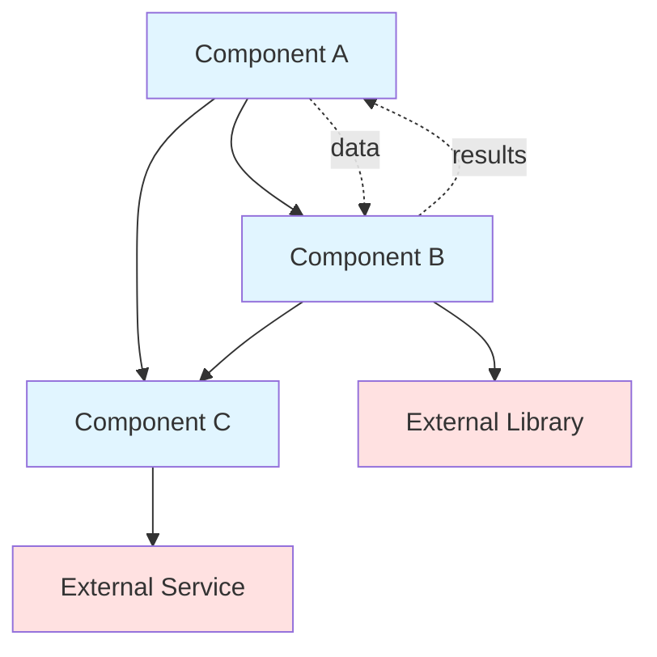
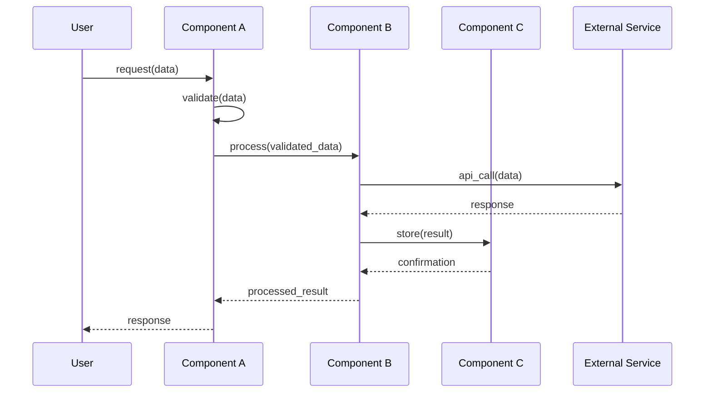
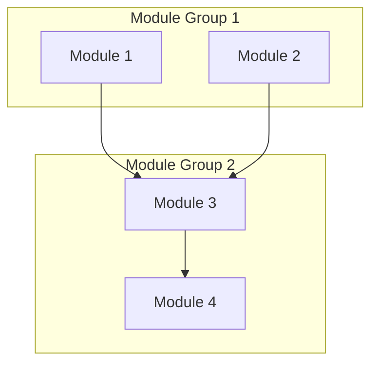

# GatoWiki Prompt Templates

This file contains reusable prompt templates for common documentation generation tasks. These templates ensure consistent quality and format across all generated documentation.

## Template 1: Module Overview Generation

### Purpose
Generate a comprehensive overview section explaining a module's purpose, responsibilities, and key concepts.

### Required Context
- `module_name`: Name of the module
- `components`: List of component names in the module
- `source_code`: Concatenated source code or key excerpts
- `sub_modules`: List of sub-module names (if any)
- `parent_module`: Name of parent module (if any)
- `dependencies`: List of dependencies (internal and external)

### Generation Steps

1. **Analyze module purpose** from:
   - Component names and their responsibilities
   - File/directory naming conventions
   - Code comments, docstrings, and module-level documentation
   - Import statements and dependencies
   - Function/method signatures

2. **Identify key concepts**:
   - Design patterns used (Factory, Singleton, Observer, etc.)
   - Architectural patterns (MVC, Repository, Service, etc.)
   - Core data models and structures
   - Main abstractions and interfaces
   - Configuration and settings management

3. **Structure overview**:
   - Write 1-2 sentence purpose statement (elevator pitch)
   - Expand with 2-3 paragraphs explaining:
     * What the module does
     * Why it exists in the system
     * How it fits into larger architecture
     * Key functionality it provides
   - List 3-5 key responsibilities
   - List 2-4 key concepts with brief explanations

### Output Format

```markdown
## Overview

[1-2 sentence purpose statement that clearly explains what this module does]

[Paragraph 1: Detailed description of module's primary purpose and what problems it solves]

[Paragraph 2: Explanation of how this module fits into the larger system architecture and its relationships with other modules]

[Paragraph 3: Key functionality provided and important implementation details]

**Key Responsibilities:**
- [Specific, actionable responsibility 1]
- [Specific, actionable responsibility 2]
- [Specific, actionable responsibility 3]

**Key Concepts:**
- **[Concept 1 Name]**: [1-2 sentence explanation]
- **[Concept 2 Name]**: [1-2 sentence explanation]
- **[Concept 3 Name]**: [1-2 sentence explanation]
```

### Validation Criteria
- ✓ Purpose statement is clear and specific (not generic)
- ✓ Description explains WHY, not just WHAT
- ✓ Responsibilities are concrete and measurable
- ✓ Key concepts are well-explained
- ✓ No boilerplate or placeholder language
- ✓ Technical terms are explained or linked

### Example

```markdown
## Overview

The CLI module provides a command-line interface for GatoWiki's documentation generation and configuration management, serving as the primary entry point for user interactions.

This module implements a clean, intuitive command structure using the Click framework, exposing core functionality through well-designed commands (`analyze`, `publish`, `config`). It handles user input validation, progress reporting, and error messaging, ensuring a smooth user experience for both interactive and automated workflows.

The CLI acts as an adapter layer between user commands and the backend analysis engine, translating command-line arguments into backend configuration objects and presenting analysis results in human-readable formats. It supports both verbose and quiet modes, JSON and text output, and integrates seamlessly with CI/CD pipelines.

**Key Responsibilities:**
- Parse and validate command-line arguments and options
- Coordinate backend code analysis and module clustering
- Display progress indicators and status updates to users
- Generate and format output in multiple formats (JSON, text, HTML)
- Handle errors gracefully with clear, actionable messages

**Key Concepts:**
- **Command Pattern**: Each CLI command is implemented as a separate module for maintainability
- **Adapter Pattern**: CLI adapters bridge user commands and backend services
- **Progressive Enhancement**: Verbose mode provides detailed output; quiet mode shows essentials only
```

---

## Template 2: Component Description

### Purpose
Document a single component (class, function, service, utility) with detailed information about its purpose, responsibilities, and usage.

### Required Context
- `component_name`: Name of the component
- `component_type`: Type (class, function, module, service, utility, interface)
- `source_code`: Complete source code of the component
- `dependencies`: Components/modules this depends on
- `usage_context`: How this component is used in the module

### Generation Steps

1. **Extract component signature**:
   - For classes: class name, inheritance, attributes, methods
   - For functions: function name, parameters, return type
   - For interfaces: interface name, required methods/properties

2. **Analyze responsibilities**:
   - Read docstrings and comments
   - Examine method/function names
   - Identify patterns in implementation
   - Note any special behaviors or constraints

3. **Document interface**:
   - Public methods/functions with signatures
   - Parameters with types and descriptions
   - Return values with types and descriptions
   - Exceptions/errors that may be raised

4. **Provide examples**:
   - Basic usage example
   - Advanced usage (if applicable)
   - Error handling example

### Output Format

```markdown
### <Component Name>

**File**: `path/to/component.py`

**Purpose**: [1-2 sentences explaining what this component does]

**Type**: [Class | Function | Service | Utility | Interface]

**Key Features**:
- [Feature 1]
- [Feature 2]
- [Feature 3]

#### Interface

##### `ComponentName` (for classes)

```python
class ComponentName(BaseClass):
    """Component docstring"""
    
    def __init__(self, param1: Type1, param2: Type2):
        """Initialize the component"""
```

**Attributes**:
- `attribute_name` (Type): Description of attribute
- `another_attr` (Type): Description

**Methods**:
- `method_name(param1: Type1, param2: Type2) -> ReturnType`: Description of what method does
- `another_method() -> None`: Description

##### `function_name` (for functions)

**Signature**:
```python
def function_name(param1: Type1, param2: Type2) -> ReturnType:
```

**Parameters**:
- `param1` (Type1): Description of parameter
- `param2` (Type2): Description of parameter

**Returns**: `ReturnType` - Description of return value

**Raises**:
- `ExceptionType`: When this exception occurs

#### Usage Example

```python
# Basic usage
component = ComponentName(param1_value, param2_value)
result = component.method_name(arg1, arg2)

# Advanced usage
with component.context_manager() as ctx:
    ctx.do_something()
```

**Dependencies**:
- Internal: [module.component1, module.component2]
- External: [third_party_lib (v1.2.3), another_lib (v2.0.0)]
```

### Validation Criteria
- ✓ Purpose clearly states what component does
- ✓ All public methods/functions documented
- ✓ Parameters and return types specified
- ✓ Usage examples are runnable
- ✓ Dependencies are complete

---

## Template 3: Architecture Diagram

### Purpose
Generate a Mermaid diagram showing component relationships, data flow, and system structure.

### Required Context
- `components`: List of all components in module
- `relationships`: How components relate (calls, uses, extends, implements)
- `data_flow`: How data moves through components
- `external_deps`: External libraries/services

### Generation Steps

1. **Identify node types**:
   - Internal components (blue)
   - Sub-modules (green)
   - External dependencies (red)
   - Data stores (yellow)

2. **Map relationships**:
   - Function calls: `A --> B`
   - Data flow: `A -.data.-> B`
   - Inheritance: `A ---|> B`
   - Composition: `A --o B`

3. **Simplify for clarity**:
   - Group similar components
   - Show only key relationships
   - Use subgraphs for logical groupings
   - Limit to 10-12 nodes max

### Output Format

````markdown
## Architecture



**Legend**:
- **Blue boxes**: Internal components
- **Red boxes**: External dependencies
- **Solid arrows**: Function calls/control flow
- **Dotted arrows**: Data flow
````

### Validation Criteria
- ✓ Valid Mermaid syntax
- ✓ All key components shown
- ✓ Relationships are clear
- ✓ Not overcrowded (≤12 nodes)
- ✓ Color coding is consistent

---

## Template 4: Interaction Analysis

### Purpose
Document how components interact, showing sequence of operations and data flow.

### Required Context
- `components`: Components involved in interaction
- `operations`: Sequence of operations/method calls
- `data`: Data passed between components
- `use_case`: Specific use case being documented

### Output Format

````markdown
## Interactions

### Component Collaboration

[1-2 paragraphs explaining how components work together to achieve functionality]

Example: "Component A receives user input and validates it. After validation, it passes the data to Component B for processing. Component B transforms the data and stores results using Component C. Finally, Component A retrieves the processed results and returns them to the user."

### Data Flow



### Design Patterns

[Identify and explain design patterns used in interactions]

Example:
- **Chain of Responsibility**: Validation handlers process request in sequence
- **Observer Pattern**: Component B notifies Component C of state changes
- **Command Pattern**: Operations encapsulated as command objects
````

### Validation Criteria
- ✓ Sequence diagram is valid
- ✓ All participants shown
- ✓ Message flow is logical
- ✓ Return values shown
- ✓ Design patterns identified correctly

---

## Template 5: Repository Overview

### Purpose
Generate repository-level documentation covering the entire system.

### Required Context
- `repository_name`: Name of the repository
- `modules`: All top-level modules with descriptions
- `module_tree`: Complete module hierarchy
- `tech_stack`: Technologies used
- `purpose`: Why repository exists

### Output Format

```markdown
# Repository: <repository_name>

## Overview

[2-3 paragraphs explaining:
- What this repository does
- Why it exists
- Who uses it
- Key features and capabilities]

## System Architecture



## Modules

### [Module 1](module1.md)
**Purpose**: Brief description
**Components**: X components
**Status**: Documented

### [Module 2](module2.md)
**Purpose**: Brief description
**Components**: Y components
**Status**: Documented

## Technology Stack

- **Language**: Python 3.12+
- **Framework**: FastAPI
- **Database**: PostgreSQL
- **Other**: List key technologies

## Getting Started

[Quick start guide with installation and basic usage]

## Documentation Index

- [Module 1 Documentation](module1.md)
- [Module 2 Documentation](module2.md)
- [API Reference](api.md)
```

---

## Template 6: Error Recovery

### Purpose
Guide for handling errors during documentation generation.

### Common Errors and Solutions

| Error Type | Cause | Recovery Strategy |
|------------|-------|------------------|
| **FileNotFound** | Source file missing | Skip component, note in docs: "[Source unavailable]" |
| **ParseError** | Invalid code syntax | Skip component, log warning, continue with others |
| **MemoryError** | File too large | Process in chunks, or skip and note limitation |
| **PermissionError** | Can't write to output | Report to user, suggest checking directory permissions |
| **MermaidSyntaxError** | Invalid diagram | Simplify diagram, reduce node count, retry |
| **EmptyModule** | No components found | Skip module, report to user "No components in module" |
| **CircularDependency** | Infinite recursion | Stop at depth 3, treat as leaf module |
| **JSONDecodeError** | Invalid module_tree | Run `gatowiki analyze` again, validate JSON structure |

### Error Reporting Template

```markdown
⚠️ Error: <Error Type>

**Component**: <component_name>
**File**: <file_path>
**Cause**: <what caused the error>

**Action Taken**: <how error was handled>

**User Action Required**: <what user should do, if anything>
```

### Recovery Workflow

1. **Catch error** with specific exception type
2. **Log details** (file, component, error message)
3. **Attempt recovery**:
   - Skip problematic component
   - Use fallback approach
   - Continue with remaining components
4. **Note in documentation** if component skipped
5. **Report to user** with clear explanation
6. **Suggest solutions** when possible

---

## Usage Guidelines

### Filename Normalization

**Always normalize module names to create friendly, readable filenames**:

| Module Name Pattern | Normalized Filename | Example |
|-------------------|---------------------|----------|
| Root/repository level | `overview.md` | `src` → `overview.md` |
| Backend modules | `backend.md` | `src/core`, `src.core` → `backend.md` |
| Frontend modules | `frontend.md` | `src/web`, `src.fe` → `frontend.md` |
| Path separators | Use last segment | `api/routes` → `routes.md` |
| Dot separators | Replace with dash | `api.routes` → `api-routes.md` |
| CamelCase/PascalCase | Convert to kebab-case | `UserService` → `user-service.md` |
| Common modules | Use standard names | `utils`, `models`, `services` |

**Why normalize?**
- **Readability**: `backend.md` is clearer than `src-be.md`
- **Consistency**: Standard names across projects
- **Discovery**: Easy to find `overview.md` vs `src.md`
- **Links**: Friendly URLs in documentation browsers

### For Orchestrator Agent

Use templates:
- **Template 1**: Module Overview - for complex modules
- **Template 3**: Architecture Diagram - show sub-modules and components
- **Template 4**: Interaction Analysis - for complex workflows
- **Template 5**: Repository Overview - for full repository docs
- **Template 6**: Error Recovery - handle failures gracefully

### For Leaf Agent

Use templates:
- **Template 1**: Module Overview - for simple modules
- **Template 2**: Component Description - for each component
- **Template 3**: Architecture Diagram - show components only
- **Template 4**: Interaction Analysis - simpler workflows
- **Template 6**: Error Recovery - handle failures

### Best Practices

1. **Always validate** output against validation criteria
2. **Test Mermaid diagrams** before including
3. **Use real examples** from actual code
4. **Be specific**, avoid generic language
5. **Include error handling** in all templates
6. **Link related content** for navigation
7. **Keep diagrams simple** (≤12 nodes)
8. **Provide context**, not just facts

---

**Template Version**: 2.0.0  
**Last Updated**: December 9, 2025  
**Maintained By**: GatoWiki Team
