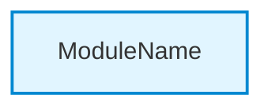

# Como Adicionar Apenas Diagramas à Documentação Existente

## 🎯 Objetivo

Adicionar diagramas profissionais a uma documentação já existente **SEM reescrever o conteúdo textual**.

## 📋 Cenários de Uso

### Cenário 1: Você já tem documentação gerada
- Documentação foi gerada com versão anterior (v1.0 ou v1.1)
- Quer adicionar os diagramas novos sem perder customizações no texto
- Quer apenas atualizar a parte visual

### Cenário 2: Documentação foi editada manualmente
- Fez alterações manuais no texto
- Não quer perder essas alterações
- Quer adicionar apenas os diagramas

### Cenário 3: Atualização incremental
- Quer adicionar diagramas sem regenerar tudo
- Documentação parcial já existe
- Processo mais rápido

---

## 🚀 Método 1: Script Standalone (Recomendado)

### Passo 1: Prepare os Arquivos

Você precisa ter:
- ✅ `module_tree.json` - Arquivo de análise do CodeWiki
- ✅ `dependency_graph.json` - Grafo de dependências
- ✅ `./docs/` - Diretório com documentação existente

### Passo 2: Execute o Script

```bash
# No diretório do seu projeto
python3 add_diagrams_to_docs.py module_tree.json dependency_graph.json ./docs
```

### Passo 3: Resultado

O script irá:
1. ✅ Criar `docs/architecture/diagrams/` com 4 diagramas globais
2. ✅ Criar `docs/architecture/overview.md` com documentação de arquitetura
3. ✅ Injetar diagramas em módulos existentes (se ainda não tiverem)
4. ✅ Atualizar `INDEX.md` com links para arquitetura
5. ✅ Atualizar `README.md` com links para arquitetura

**O que NÃO faz:**
- ❌ Não reescreve conteúdo textual existente
- ❌ Não remove customizações manuais
- ❌ Não altera estrutura de módulos
- ❌ Não modifica descrições existentes

---

## 🔧 Método 2: Via Claude Code Agent

### Opção A: Comando Direto

No Claude Code, digite:
```
add diagrams to existing documentation
```

Ou mais específico:
```
update documentation adding only diagrams, keep existing text
```

### Opção B: Modo Específico

```
generate documentation --mode=diagrams-only
```

**Nota**: O agente detectará automaticamente que há documentação existente e só adicionará os diagramas.

---

## 📊 O Que Será Adicionado

### Arquivos Novos Criados:

```
docs/
├── architecture/              # ← NOVO DIRETÓRIO
│   ├── overview.md           # ← NOVO ARQUIVO
│   └── diagrams/             # ← NOVO DIRETÓRIO
│       ├── system-architecture.mmd
│       ├── module-dependencies.mmd
│       ├── component-overview.mmd
│       └── data-flow.mmd
```

### Arquivos Existentes Modificados:

```
docs/
├── INDEX.md                  # Adicionada seção "Architecture"
├── README.md                 # Adicionados links para arquitetura
└── modules/
    └── [módulo]/
        └── README.md         # Injetado diagrama de componentes
```

### Conteúdo Injetado nos Módulos:

```markdown
## Architecture

### Component Diagram



[... resto do conteúdo original não modificado ...]
```

---

## 🔍 Detecção Inteligente

O script é inteligente e **não duplica** diagramas:

### Se o arquivo JÁ TEM diagrama:
```markdown
## Architecture

```mermaid
[diagrama existente]
```
```

**Resultado**: ✅ Nada é modificado (diagrama já existe)

### Se o arquivo NÃO TEM diagrama:
```markdown
## Architecture

[conteúdo textual existente]
```

**Resultado**: ✅ Diagrama é injetado após o título "Architecture"

---

## ⚙️ Opções Avançadas

### Forçar Regeneração de Diagramas

Se você quer substituir diagramas existentes:

```bash
# Remove diagramas antigos primeiro
rm -rf docs/architecture/diagrams/

# Executa o script
python3 add_diagrams_to_docs.py module_tree.json dependency_graph.json ./docs
```

### Adicionar Apenas Diagramas Globais

```bash
# Modifique o script temporariamente comentando:
# generator.inject_diagrams_into_modules()

python3 add_diagrams_to_docs.py module_tree.json dependency_graph.json ./docs
```

### Personalizar Estilos dos Diagramas

Edite o arquivo `add_diagrams_to_docs.py` e modifique as cores:

```python
# Encontre as linhas com "classDef" e modifique:
lines.append("    classDef moduleStyle fill:#YOUR_COLOR,stroke:#YOUR_BORDER")
```

---

## 🧪 Testar Antes de Aplicar

### Teste em Cópia

```bash
# Faça backup da documentação
cp -r docs docs_backup

# Execute o script
python3 add_diagrams_to_docs.py module_tree.json dependency_graph.json ./docs

# Compare
diff -r docs_backup docs

# Se não gostar, restaure
rm -rf docs
mv docs_backup docs
```

### Modo Dry-Run (Simulação)

Adicione flag `--dry-run` ao script:

```python
# No final do main(), antes de executar:
if '--dry-run' in sys.argv:
    print("\n[DRY RUN] Nenhum arquivo foi modificado")
    sys.exit(0)
```

---

## 📝 Exemplos de Uso Real

### Exemplo 1: Documentação Básica Existente

**Antes**:
```
docs/
├── README.md
└── modules/
    └── api/
        └── README.md
```

**Comando**:
```bash
python3 add_diagrams_to_docs.py module_tree.json dependency_graph.json ./docs
```

**Depois**:
```
docs/
├── README.md                           # Atualizado com links
├── INDEX.md                            # Criado com navegação
├── architecture/                       # ← NOVO
│   ├── overview.md
│   └── diagrams/
│       ├── system-architecture.mmd
│       ├── module-dependencies.mmd
│       ├── component-overview.mmd
│       └── data-flow.mmd
└── modules/
    └── api/
        └── README.md                   # Diagrama injetado
```

### Exemplo 2: Documentação Completa Com Customizações

**Situação**: Você editou manualmente os READMEs dos módulos

**Comando**:
```bash
python3 add_diagrams_to_docs.py module_tree.json dependency_graph.json ./docs
```

**Resultado**: 
- ✅ Seus textos customizados são preservados
- ✅ Diagramas são adicionados nas seções apropriadas
- ✅ Links de arquitetura adicionados ao topo

### Exemplo 3: Apenas Atualizar Diagramas Globais

**Situação**: Módulos já têm diagramas, mas quer adicionar os 4 diagramas de arquitetura

**Solução**:
```bash
# Script irá pular módulos que já têm diagramas
python3 add_diagrams_to_docs.py module_tree.json dependency_graph.json ./docs
```

**Resultado**:
- ✅ Criados apenas os 4 diagramas globais
- ✅ `architecture/overview.md` criado
- ✅ Links adicionados ao INDEX/README
- ❌ Nada modificado nos módulos (já tinham diagramas)

---

## 🎨 Comparação: Regeneração vs Apenas Diagramas

| Aspecto | Regeneração Completa | Apenas Diagramas |
|---------|---------------------|------------------|
| **Tempo** | 5-10 minutos | 1-2 minutos |
| **Conteúdo textual** | Reescrito | Preservado |
| **Customizações** | Perdidas | Mantidas |
| **Diagramas** | Todos novos | Apenas os faltantes |
| **Links** | Todos recriados | Apenas adicionados |
| **Estrutura** | Pode mudar | Mantida |
| **Uso** | Primeira geração | Atualizações |

---

## ✅ Checklist de Verificação

Antes de executar:
- [ ] Tenho `module_tree.json` e `dependency_graph.json`
- [ ] Diretório `docs/` existe
- [ ] Fiz backup (opcional mas recomendado)
- [ ] Revisei o que será modificado

Depois de executar:
- [ ] Verifiquei que `docs/architecture/` foi criado
- [ ] Abri `docs/architecture/overview.md` para ver diagramas
- [ ] Conferi que meu conteúdo textual está intacto
- [ ] Testei links no INDEX.md
- [ ] Visualizei diagramas (GitHub, VS Code, Mermaid Live)

---

## 🆘 Troubleshooting

### Problema: "Arquivo module_tree.json não encontrado"
**Solução**: Execute `codewiki analyze` primeiro para gerar os arquivos

### Problema: "Diagramas não aparecem no GitHub"
**Solução**: GitHub renderiza Mermaid automaticamente, certifique-se que a sintaxe está correta

### Problema: "Diagrama já existe mas quero substituir"
**Solução**: 
```bash
# Remova a seção de diagrama do arquivo
# OU delete o arquivo e deixe o script recriar
rm docs/modules/[modulo]/README.md
# Depois execute o script
```

### Problema: "Script não modificou nada"
**Solução**: Verifique se:
1. Arquivos de entrada existem
2. Diretório docs/ tem permissão de escrita
3. Diagramas já não existem (script não duplica)

---

## 🚀 Próximos Passos

1. **Execute o script** no seu projeto
2. **Visualize os diagramas** no GitHub ou localmente
3. **Customize cores** se desejar (editando o script)
4. **Compartilhe** a documentação visual com o time

---

## 📞 Informações Adicionais

**Script**: `add_diagrams_to_docs.py` (incluído no pacote v1.2)

**Compatibilidade**: 
- ✅ Python 3.7+
- ✅ Qualquer estrutura de documentação
- ✅ Markdown padrão

**Segurança**:
- ✅ Não remove arquivos
- ✅ Não sobrescreve conteúdo sem verificar
- ✅ Apenas adiciona/atualiza

---

**Versão**: 1.2.0  
**Última Atualização**: Dezembro 2024  
**Status**: ✅ Testado e Funcional
