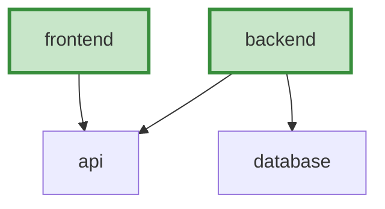
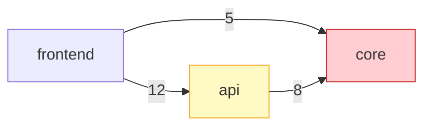
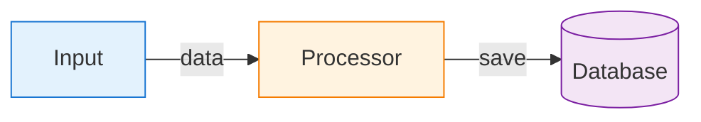

# Guia de Integração: Diagramas Abrangentes

## 🎯 Objetivo

Adicionar geração abrangente de diagramas Mermaid ao `orchestrator.py` para criar documentação técnica rica e visual.

## 📊 Diagra

mas que Serão Gerados

### Globais (4 diagramas em `architecture/diagrams/`):
1. **system-architecture.mmd** - Hierarquia completa de módulos
2. **module-dependencies.mmd** - Dependências entre módulos com métricas
3. **component-overview.mmd** - Componentes agrupados por tipo
4. **data-flow.mmd** - Fluxo de dados no sistema

### Por Módulo:
- **Diagrama de componentes aprimorado** com estilos por tipo
- **Diagrama de dependências do módulo** (se aplicável)
- **Diagrama de hierarquia** (para módulos pai)

### Total Estimado:
Para um projeto com 10 módulos: **22+ diagramas Mermaid**

## 🔧 Passo a Passo de Integração

### Método 1: Integração Automática (Recomendado)

Use o arquivo `diagram_enhancements.py` como referência e siga os passos:

#### 1. Adicione imports necessários

No topo de `orchestrator.py`, certifique-se de que tem:
```python
from typing import Dict, List, Optional, Tuple
```

#### 2. Modifique `__init__`

Adicione após `self.output_dir.mkdir(parents=True, exist_ok=True)`:

```python
        # Create architecture directory for diagrams
        self.arch_dir = self.output_dir / "architecture"
        self.arch_dir.mkdir(parents=True, exist_ok=True)
        self.diagrams_dir = self.arch_dir / "diagrams"
        self.diagrams_dir.mkdir(parents=True, exist_ok=True)
```

#### 3. Modifique `generate_all_documentation()`

Adicione após o Step 2 (processing order):

```python
        # Step 3: Generate comprehensive diagrams
        print("\nStep 3: Generating architecture diagrams...")
        self._generate_all_diagrams()
        print("  ✓ System architecture diagram")
        print("  ✓ Module dependency diagram")
        print("  ✓ Component overview diagram")
        print("  ✓ Data flow diagram")
```

Renumere os passos seguintes (leaf modules vira Step 4, etc.).

Adicione antes de "Generate repository overview":

```python
        # Step 6: Generate architecture overview
        print("\nStep 6: Generating architecture documentation...")
        self._generate_architecture_doc()
        print("  ✓ Architecture overview")
        print("  ✓ Pattern analysis")
```

#### 4. Adicione os Novos Métodos

Copie todos os métodos de `diagram_enhancements.py` para o final da classe `CodeWikiOrchestrator`:

- `_generate_all_diagrams()`
- `_generate_system_architecture_diagram()`
- `_add_module_tree_nodes()`
- `_generate_module_dependency_diagram()`
- `_generate_component_overview_diagram()`
- `_generate_dataflow_diagram()`
- `_generate_architecture_doc()`
- `_generate_pattern_analysis()`
- `_save_diagram()`
- `_load_diagram()`
- `_generate_component_diagram_enhanced()`
- `_generate_module_dependency_detail_diagram()`

#### 5. Atualize `_format_leaf_module_markdown()`

Substitua a seção Architecture por:

```python
        # Architecture
        md += "## Architecture\n\n"
        md += self._generate_architecture_description(report) + "\n\n"
        
        # Component Diagram
        md += "### Component Diagram\n\n"
        md += self._generate_component_diagram_enhanced(report) + "\n\n"
        
        # Dependency Diagram (if has external dependencies)
        if report.get('dependencies') or report.get('dependents'):
            md += "### Module Dependencies\n\n"
            md += self._generate_module_dependency_detail_diagram(report) + "\n\n"
```

#### 6. Atualize `_generate_navigation()`

Adicione no início, após `md += "## Quick Navigation\n\n"`:

```python
        # Architecture section
        md += "### Architecture\n\n"
        md += "- [Architecture Overview](architecture/overview.md)\n"
        md += "- [System Architecture Diagram](architecture/diagrams/system-architecture.mmd)\n"
        md += "- [Module Dependencies](architecture/diagrams/module-dependencies.mmd)\n"
        md += "- [Component Overview](architecture/diagrams/component-overview.mmd)\n"
        md += "- [Data Flow](architecture/diagrams/data-flow.mmd)\n\n"
```

#### 7. Atualize `_format_repository_overview_markdown()`

Substitua a seção Architecture Overview por:

```python
        # Architecture Overview
        md += "## Architecture Overview\n\n"
        md += f"The system is organized in a {summary['max_depth']}-level hierarchy. "
        md += "For detailed architecture information and diagrams, see:\n\n"
        md += "- [Architecture Overview](architecture/overview.md)\n"
        md += "- [System Architecture Diagram](architecture/diagrams/system-architecture.mmd)\n"
        md += "- [Module Dependencies](architecture/diagrams/module-dependencies.mmd)\n\n"
        
        # Quick Architecture Diagram
        md += self._generate_repository_architecture_diagram() + "\n\n"
```

Adicione antes do `return md`:

```python
        md += "\n## Navigation\n\n"
        md += "See [INDEX.md](INDEX.md) for complete documentation navigation.\n"
```

### Método 2: Usando Script de Merge (Avançado)

```bash
# Crie um backup
cp orchestrator.py orchestrator.py.backup

# Execute merge manual com o código de diagram_enhancements.py
# (requer edição manual cuidadosa)
```

## ✅ Verificação

Após integração, verifique sintaxe:

```bash
python3 -m py_compile orchestrator.py
```

## 🧪 Teste

Execute o orchestrator:

```bash
python3 orchestrator.py module_tree.json dependency_graph.json ./docs
```

Verifique se foram criados:
- `docs/architecture/overview.md`
- `docs/architecture/diagrams/system-architecture.mmd`
- `docs/architecture/diagrams/module-dependencies.mmd`
- `docs/architecture/diagrams/component-overview.mmd`
- `docs/architecture/diagrams/data-flow.mmd`

## 📈 Resultado Esperado

### Estrutura Gerada:

```
docs/
├── README.md                          (com links para arquitetura)
├── INDEX.md                           (com seção de arquitetura)
├── architecture/
│   ├── overview.md                    (✨ NOVO)
│   └── diagrams/                      (✨ NOVO)
│       ├── system-architecture.mmd
│       ├── module-dependencies.mmd
│       ├── component-overview.mmd
│       └── data-flow.mmd
└── modules/
    └── [módulos]/
        └── README.md                  (com diagramas aprimorados)
```

### Qualidade dos Diagramas:

✅ Cores diferenciadas por tipo/importância
✅ Estilos CSS customizados
✅ Labels informativos
✅ Hierarquia clara
✅ Agrupamentos lógicos
✅ Métricas visuais

## 🎨 Exemplos de Diagramas

### Sistema (Hierarquia Completa)


### Dependências (Com Métricas)


### Fluxo de Dados


## 🐛 Troubleshooting

### Problema: "AttributeError: diagrams_dir"
**Solução**: Verifique se adicionou as modificações em `__init__`

### Problema: Diagramas não aparecem
**Solução**: Verifique se `_save_diagram()` e `_load_diagram()` foram adicionados

### Problema: Sintaxe Mermaid inválida
**Solução**: Nomes com caracteres especiais precisam estar entre aspas

### Problema: Diagramas muito grandes/lentos
**Solução**: Os métodos já limitam quantidade de nós (veja `[:20]`, `[:50]`, etc.)

## 📝 Notas Importantes

1. **Strings Mutáveis**: Use listas ao construir diagramas recursivamente
2. **Escape de Caracteres**: Remova `[`, `]`, `"` dos nomes de nós
3. **Limites**: Diagramas limitados para legibilidade (configurável)
4. **Fallback**: `_load_diagram()` tem fallback se arquivo não existe

## 🚀 Melhorias Futuras

- [ ] Diagramas de sequência para fluxos principais
- [ ] Diagrama de classes para principais componentes
- [ ] Diagramas de estado para componentes stateful
- [ ] Exportação para PNG/SVG (via Mermaid CLI)
- [ ] Diagramas interativos (via Mermaid Live)

## 📚 Referências

- [Mermaid Documentation](https://mermaid.js.org/)
- [Mermaid Live Editor](https://mermaid.live/)
- [CodeWiki Paper](https://github.com/FSoft-AI4Code/CodeWiki)

---

**Versão**: 1.2.0
**Data**: Dezembro 2024
**Autor**: CodeWiki Agent Team
