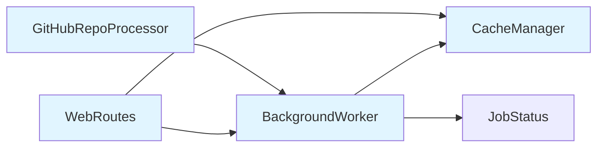
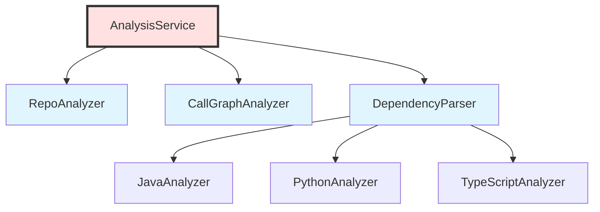
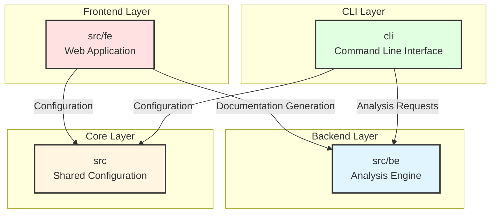

# Interactive Claude Usage Guide

This guide shows how Claude can use the CodeWiki Skills system interactively with users to generate documentation step-by-step.

## Conversation Flow Patterns

### Pattern 1: User Uploads Files

```
User: [uploads module_tree.json and dependency_graph.json]
      "Can you generate CodeWiki-style documentation for my repository?"

Claude Response:
```

I'll generate comprehensive CodeWiki-style documentation for your repository. Let me start by analyzing the structure.

```python
# Analyzing repository...
analyzer = CodeWikiAnalyzer("module_tree.json", "dependency_graph.json")
summary = analyzer.get_repository_summary()
```

I've analyzed your repository:
- **Total Modules**: 4 (src/fe, src/be, cli, src)
- **Total Components**: 158
- **Structure**: Flat hierarchy (all leaf modules)

I'll generate documentation in this order:
1. Document each leaf module (src/fe, src/be, cli, src)
2. Create repository overview with architecture diagrams
3. Build navigation index

Would you like me to proceed with complete documentation, or would you prefer to focus on specific modules first?

### Pattern 2: Progressive Generation

```
User: "Go ahead with complete documentation"

Claude Response:
```

Perfect! I'll generate the documentation progressively. Starting with leaf modules...

**Module 1/4: src/fe** (Frontend Module)

Analyzing... ✓
- 10 components identified
- High cohesion (80%)
- 1 external dependency (src/be)

Generating documentation...

---

# Module: src/fe

## Overview
The frontend module manages the web application layer with 10 components organized around background task processing, caching, and request handling. It demonstrates high cohesion (80%) with components working closely together to provide the user-facing interface.

## Architecture
The module implements a background worker pattern with:
- **BackgroundWorker**: Orchestrates asynchronous documentation generation
- **CacheManager**: Handles result caching for improved performance
- **WebRoutes**: Manages HTTP endpoints and request routing
- **GitHubRepoProcessor**: Processes GitHub repository submissions



[... complete module documentation ...]

---

**Module 2/4: src/be** (Backend Module)

Analyzing... ✓
- 19 components identified
- Core processing engine
- Zero external dependencies (foundational module)

[... continues with each module ...]

### Pattern 3: Focused Generation

```
User: "Just document the src/be module first"

Claude Response:
```

I'll create comprehensive documentation for the src/be (backend) module.

Analyzing... ✓

**src/be Module Analysis:**
- **Components**: 19
- **Role**: Core backend processing and analysis engine
- **Patterns Detected**: Layered architecture with analyzers and services
- **Complexity**: High (multiple language analyzers)

Here's the complete documentation:

[... generates focused module doc ...]

Would you like me to:
1. Document another module?
2. Generate the repository overview?
3. Dive deeper into specific components?

### Pattern 4: Component Deep-Dive

```
User: "Can you explain the AnalysisService component in detail?"

Claude Response:
```

Let me analyze the AnalysisService component specifically.

```python
# Analyzing AnalysisService
comp_id = "gatowiki.src.be.dependency_analyzer.analysis.analysis_service.AnalysisService"
analysis = analyzer.analyze_dependencies(comp_id)
purpose = analyzer.infer_component_purpose(comp_id)
```

## AnalysisService Deep Dive

### Overview
**AnalysisService** is a core orchestration component in the backend that coordinates the entire code analysis workflow.

**Type**: class
**Location**: `gatowiki/src/be/dependency_analyzer/analysis/analysis_service.py`
**Role**: Service orchestrator
**Purpose**: Manages the end-to-end analysis pipeline from repository input to dependency graph output

### Responsibilities
1. **Workflow Coordination**: Orchestrates the complete analysis pipeline
2. **Component Integration**: Integrates multiple analyzer implementations
3. **Result Aggregation**: Combines results from language-specific analyzers
4. **Error Handling**: Manages exceptions across the analysis process

### Dependencies
**Internal Dependencies** (same module):
- RepoAnalyzer: Repository-level analysis
- CallGraphAnalyzer: Call graph construction
- DependencyParser: AST parsing coordination

**External Dependencies** (other modules):
- TreeSitterJavaAnalyzer: Java code analysis
- TreeSitterPythonAnalyzer: Python code analysis
- [... other language analyzers]

### Architectural Role


[... complete component documentation ...]

### Pattern 5: Diagram Generation

```
User: "Can you create an architecture diagram showing how all the modules interact?"

Claude Response:
```

I'll create a comprehensive system architecture diagram showing all module interactions.

```python
# Analyzing cross-module dependencies
modules = ['src/fe', 'src/be', 'cli', 'src']
dependencies = {}
for module in modules:
    analysis = analyzer.analyze_module_dependencies(module)
    dependencies[module] = analysis['external_dependencies']
```

## System Architecture



### Module Interactions

**src/fe → src/be**
- Frontend calls DocumentationGenerator from backend
- Submits repository URLs for analysis
- Receives generated documentation

**cli → src/be**
- CLI invokes analysis services
- Requests dependency graphs
- Generates documentation locally

**src/fe, cli → src**
- Both access shared configuration (Config)
- Use common FileManager utilities

This architecture demonstrates a clean separation of concerns with the backend (src/be) serving as the core analysis engine, while frontend (src/fe) and CLI (cli) provide different user interfaces to the same functionality.

### Pattern 6: Comparison and Recommendations

```
User: "What architectural patterns does this codebase use?"

Claude Response:
```

Based on my analysis of the dependency graph and module structure, I've identified several architectural patterns:

## Detected Patterns

### 1. **Layered Architecture** ✓
**Confidence**: High (85%)

**Evidence**:
- Clear separation between frontend (src/fe), backend (src/be), and CLI (cli)
- Unidirectional dependencies (frontend → backend, not vice versa)
- Core utilities in separate module (src)

**Benefits**:
- Maintainability: Changes in one layer don't affect others
- Testability: Each layer can be tested independently
- Flexibility: Can add new interfaces (e.g., REST API) easily

### 2. **Strategy Pattern** ✓
**Confidence**: High (90%)

**Evidence**:
- Multiple language analyzers implementing common interface
- TreeSitterJavaAnalyzer, TreeSitterPythonAnalyzer, etc.
- All follow same analysis contract

**Location**: src/be/dependency_analyzer/analyzers/

**Benefits**:
- Extensibility: Easy to add new language support
- Consistency: Uniform analysis interface
- Maintainability: Language-specific logic isolated

### 3. **Facade Pattern** ✓
**Confidence**: Medium (70%)

**Evidence**:
- DocumentationGenerator provides unified interface
- Hides complexity of analysis pipeline
- Single entry point for documentation generation

**Location**: src/be/documentation_generator.DocumentationGenerator

**Benefits**:
- Simplicity: Clients don't need to understand internal complexity
- Flexibility: Can refactor internal implementation without affecting clients
- Usability: Clear, simple API for documentation generation

### 4. **Background Worker Pattern** ✓
**Confidence**: High (80%)

**Evidence**:
- BackgroundWorker for asynchronous processing
- Job status tracking (JobStatus, JobStatusResponse)
- Cache management for long-running tasks

**Location**: src/fe/background_worker.BackgroundWorker

**Benefits**:
- Responsiveness: UI doesn't block during analysis
- Scalability: Can handle multiple concurrent requests
- User Experience: Progress tracking and status updates

## Recommendations

Based on these patterns, I recommend:

1. **Consider Observer Pattern** for job completion notifications
   - Currently: Polling for job status
   - Improvement: Event-based notifications

2. **Add Factory Pattern** for analyzer instantiation
   - Currently: Direct instantiation
   - Improvement: Centralized analyzer creation logic

3. **Consider Repository Pattern** for caching layer
   - Currently: Direct cache management
   - Improvement: Abstraction over cache implementation

Would you like me to provide detailed examples for any of these recommendations?

## Usage Tips for Claude

When working with this system:

### 1. Always Start with Analysis
```python
analyzer = CodeWikiAnalyzer("module_tree.json", "dependency_graph.json")
summary = analyzer.get_repository_summary()
```
This gives you context before generating documentation.

### 2. Use Processing Order
```python
processing_order = analyzer.get_processing_order()
```
Document modules in this order (bottom-up) for best results.

### 3. Generate Progressively
Don't try to generate everything at once. Go module by module and show progress.

### 4. Provide Context
Always explain what you're analyzing before showing results. Users appreciate understanding the process.

### 5. Offer Choices
Give users options:
- "Would you like me to document all modules or focus on specific ones?"
- "Should I include detailed component documentation or just overviews?"
- "Do you want me to generate diagrams for each module?"

### 6. Be Transparent About Inference
When inferring purposes or patterns, be clear about confidence:
- "Based on the component name and dependencies, this appears to be a service orchestrator"
- "The module shows characteristics of a layered architecture (confidence: 85%)"

### 7. Validate with User
For important decisions:
- "I've detected a plugin pattern - does this match your understanding?"
- "Should I document these as microservices or as modules?"

### 8. Provide Navigation
Help users navigate the documentation:
- "I've documented src/fe. Next I'll do src/be, which is the core analysis engine."
- "The complete documentation includes 4 module docs plus a repository overview."

## Example Complete Session

```
User: [uploads files] "Generate documentation"

Claude:
1. "Analyzing... 4 modules, 158 components ✓"
2. "Documenting src/fe... ✓"
3. "Documenting src/be... ✓"
4. "Documenting cli... ✓"
5. "Documenting src... ✓"
6. "Generating overview... ✓"
7. "Creating navigation... ✓"
8. "Complete! Documentation in /docs with:"
   - README.md (repository overview)
   - INDEX.md (navigation)
   - modules/ (4 module docs)
   - Mermaid diagrams throughout

User: "Can you explain the src/be module more?"

Claude:
[Provides detailed deep-dive on src/be]
- 19 components
- Core analysis engine
- Multiple language support
- Layered + Strategy patterns
[Detailed component breakdowns]
[Additional diagrams]

User: "What should I focus on if I'm new to this codebase?"

Claude:
"Based on the architecture, here's a learning path:

1. **Start with**: src/be/documentation_generator.py
   - Main entry point
   - Shows overall workflow
   
2. **Then explore**: src/be/dependency_analyzer/analysis/
   - Core analysis logic
   - Key algorithms
   
3. **Finally review**: Language-specific analyzers
   - See how different languages are handled
   
I can generate a detailed onboarding guide if you'd like!"
```

## Summary

The key to using this system effectively:
- **Analyze first**: Always run analysis before generating
- **Generate progressively**: Go module by module
- **Be interactive**: Offer choices and validate understanding
- **Provide context**: Explain what you're doing and why
- **Create value**: Generate useful, navigable documentation
- **Be transparent**: Clearly indicate inferences and confidence levels

This creates a collaborative documentation generation experience that leverages both automated analysis and Claude's natural language capabilities.
