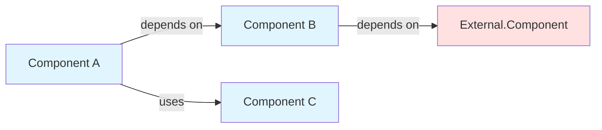
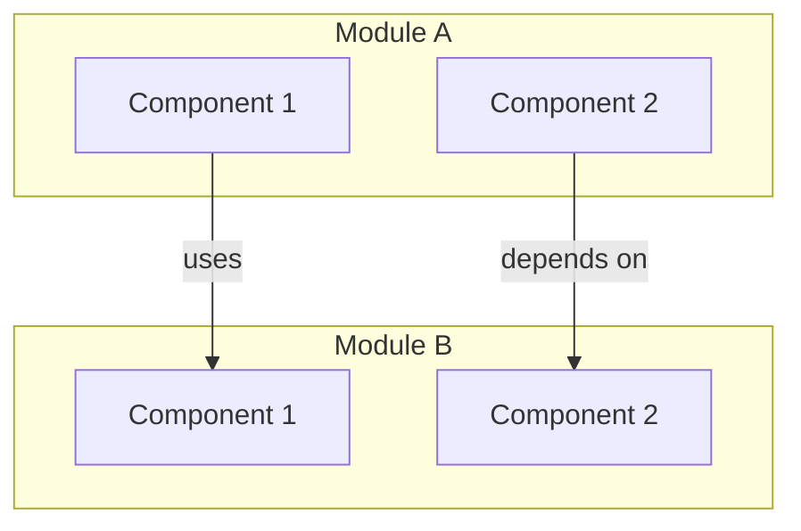
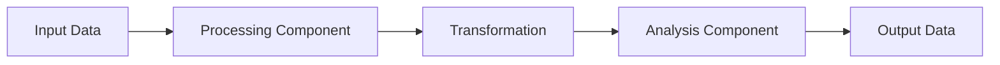
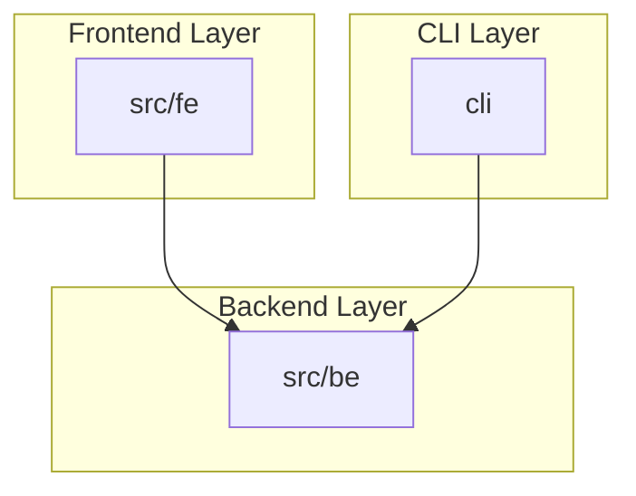

# CodeWiki Documentation Generator Skill

## Overview
This skill enables Claude to generate comprehensive, repository-level documentation in the CodeWiki style by analyzing module trees and dependency graphs. The system uses a hierarchical, recursive approach inspired by the CodeWiki research paper to create architecture-aware documentation with visual artifacts.

## Core Capabilities
- **Hierarchical Documentation Generation**: Process modules bottom-up, from leaf components to root-level overview
- **Dependency-Aware Analysis**: Understand cross-module relationships and data flows
- **Multi-Modal Synthesis**: Generate textual documentation with architecture diagrams, data-flow visualizations, and sequence diagrams
- **Recursive Processing**: Handle repositories of arbitrary size through dynamic decomposition
- **Cross-Reference Management**: Maintain coherence across module boundaries

## When to Use This Skill
Use this skill when:
- The user uploads `module_tree.json` and `dependency_graph.json` files
- The user requests "CodeWiki-style documentation"
- The user asks to "generate repository documentation"
- The user wants architectural documentation with diagrams
- The user needs comprehensive, hierarchical codebase documentation

## Input Requirements
1. **module_tree.json**: Hierarchical structure of code modules with:
   - Module paths and names
   - Component lists (fully qualified IDs)
   - Parent-child relationships
   
2. **dependency_graph.json**: Dependency relationships with:
   - Component metadata (id, name, type, file paths)
   - `depends_on` arrays showing relationships
   - Component types (class, function, module, etc.)

## Core Workflow

### Phase 1: Analysis & Understanding
1. **Parse Input Files**
   ```python
   # Load and validate structure
   module_tree = load_json("module_tree.json")
   dependency_graph = load_json("dependency_graph.json")
   ```

2. **Analyze Module Hierarchy**
   - Identify leaf modules (no children)
   - Identify parent modules with children
   - Map components to their modules
   - Calculate module complexity

3. **Build Relationship Maps**
   - Create component → module mapping
   - Build dependency lookup structures
   - Identify cross-module dependencies
   - Find entry points (zero-dependencies components)

### Phase 2: Leaf Module Documentation
For each leaf module (modules with no children):

1. **Component Analysis**
   - Extract all components in the module
   - Gather metadata from dependency graph
   - Identify component types and roles
   - Analyze dependencies (internal & external)

2. **Generate Component Documentation**
   ```markdown
   ## Component: [Name]
   
   **Type**: [class/function/module]
   **Path**: [file path]
   **Module**: [parent module path]
   
   ### Purpose
   [Inferred from dependencies and context]
   
   ### Dependencies
   - Internal: [components within same module]
   - External: [components from other modules]
   
   ### Used By
   [Components that depend on this one]
   
   ### Key Responsibilities
   [Inferred from dependency patterns]
   ```

3. **Create Module-Level Documentation**
   ```markdown
   # Module: [module path]
   
   ## Overview
   [Synthesized summary of module purpose]
   
   ## Architecture
   [Component relationships within module]
   
   ## Components
   [List of all components with summaries]
   
   ## External Dependencies
   [Modules this depends on]
   
   ## Dependents
   [Modules that depend on this]
   ```

4. **Generate Visual Artifacts**
   - Component dependency diagram (Mermaid)
   - Data flow within module
   - Class hierarchy (if applicable)

### Phase 3: Parent Module Synthesis
For parent modules (bottom-up traversal):

1. **Aggregate Child Documentation**
   - Collect all child module docs
   - Identify common patterns
   - Extract architectural themes
   
2. **Synthesize High-Level Documentation**
   ```markdown
   # Module: [parent module path]
   
   ## Overview
   [High-level purpose synthesized from children]
   
   ## Architecture
   [How submodules collaborate]
   
   ## Submodules
   [List of child modules with their purposes]
   
   ## Key Features
   [Capabilities provided by this module tree]
   
   ## Dependencies & Integration
   [External dependencies and usage patterns]
   ```

3. **Create Architectural Diagrams**
   - Module hierarchy visualization
   - Inter-module communication
   - Data flow across modules
   - System-level architecture

### Phase 4: Repository Overview Generation
Final synthesis at root level:

1. **Generate Repository Overview**
   ```markdown
   # [Repository Name] - Documentation
   
   ## Purpose
   [Overall system purpose and goals]
   
   ## End-to-End Architecture
   [System-level architecture diagram]
   
   ## Module Structure
   [Hierarchical view of all modules]
   
   ## Core Features
   [Major capabilities by module]
   
   ## Getting Started
   [Entry points and usage patterns]
   
   ## Module Documentation
   [Links to detailed module docs]
   ```

2. **Create System Diagrams**
   - Complete system architecture
   - Component interaction overview
   - Data flow across system
   - Deployment/runtime architecture

## Documentation Templates

### Component Documentation Template
```markdown
## [Component Name]

**Type**: [class|function|module|interface]
**Location**: `[file path]`
**Module**: [parent module]

### Purpose
[1-2 sentence description of what this component does]

### Responsibilities
[Bullet list of key responsibilities inferred from dependencies]

### Dependencies
**Internal Dependencies** (within module):
- [Component]: [relationship type]

**External Dependencies** (cross-module):
- [Module.Component]: [relationship type]

### Dependents
[Components that use this one]

### Interface
[Public methods/functions/exports if applicable]

### Usage Pattern
```[language]
[Example usage based on dependency patterns]
```

### Related Components
[Components with similar responsibilities or strong relationships]
```

### Module Documentation Template
```markdown
# [Module Path]

## Overview
[Comprehensive description of module purpose and scope]

## Architecture
[Description of how components within this module work together]

```mermaid
graph TD
    [Component dependency diagram]
```

## Components

### Core Components
[List of main components with brief descriptions]

### Supporting Components
[List of utility/helper components]

## Features
[Key capabilities provided by this module]

## Dependencies

### Internal Dependencies
[Dependencies within same parent module]

### External Dependencies
[Cross-module dependencies]

## Usage Examples
[How other modules use this module]

## Related Modules
[Sibling or related modules]
```

## Diagram Generation Guidelines

### Component Dependency Diagrams


### Module Architecture Diagrams


### Data Flow Diagrams


### System Architecture Diagrams


## Analysis Heuristics

### Inferring Component Purpose
1. **From Dependencies**: 
   - Many dependencies → orchestrator/controller
   - No dependencies → data model/utility
   - Specific type dependencies → specialized processor

2. **From Dependents**:
   - Many dependents → core/shared component
   - Few dependents → specialized feature
   - No dependents → entry point or unused

3. **From Name & Type**:
   - `*Manager` → lifecycle/resource management
   - `*Service` → business logic
   - `*Generator` → creation/transformation
   - `*Analyzer` → inspection/analysis
   - `*Parser` → data transformation
   - `*Builder` → construction pattern

### Identifying Architectural Patterns
- **Layered Architecture**: Modules with clear dependency direction
- **Event-Driven**: Components with `Event`, `Handler`, `Listener` patterns
- **Plugin Architecture**: Many similar components with common interface
- **Adapter Pattern**: Components named `*Adapter` or bridging disparate systems
- **Factory Pattern**: Components named `*Factory` or `*Builder`

## Best Practices

### 1. Documentation Quality
- **Clarity**: Use clear, concise language
- **Completeness**: Cover all components systematically
- **Accuracy**: Base descriptions on actual dependencies
- **Consistency**: Use consistent terminology and structure
- **Usefulness**: Focus on information developers need

### 2. Visual Artifacts
- **Simplicity**: Don't overcomplicate diagrams
- **Focus**: Show relevant relationships, hide noise
- **Hierarchy**: Use subgraphs for logical grouping
- **Color**: Use color to indicate categories (internal/external)
- **Labels**: Clear, descriptive edge labels

### 3. Cross-References
- **Linking**: Link related components and modules
- **Context**: Provide enough context at each level
- **Navigation**: Enable easy movement between levels
- **Consistency**: Use consistent referencing format

### 4. Inference Guidelines
- **Conservative**: Don't overstate what can be inferred
- **Evidence-Based**: Base inferences on dependency patterns
- **Qualified**: Use "likely", "appears to" when uncertain
- **Transparent**: Explain reasoning when non-obvious

## Processing Strategy

### For Small Repositories (< 50 components)
1. Process all leaf modules in single pass
2. Generate all diagrams up front
3. Synthesize parent modules
4. Create comprehensive overview

### For Medium Repositories (50-200 components)
1. Process leaf modules in batches by parent
2. Generate diagrams incrementally
3. Synthesize parent modules progressively
4. Assemble overview from parent docs

### For Large Repositories (> 200 components)
1. Process leaf modules in phases
2. Generate core diagrams first, details on-demand
3. Synthesize critical parent modules
4. Create overview with drill-down links
5. Consider module-by-module generation

## Output Structure
```
/docs/
├── README.md                 # Repository Overview
├── architecture/
│   ├── system.md            # System-level architecture
│   ├── diagrams/            # Architecture diagrams
│   └── data-flows.md        # Data flow documentation
├── modules/
│   ├── src/
│   │   ├── fe/
│   │   │   ├── README.md    # src/fe module doc
│   │   │   └── components.md
│   │   ├── be/
│   │   │   ├── README.md    # src/be module doc
│   │   │   └── components.md
│   │   └── README.md        # src module overview
│   └── cli/
│       ├── README.md        # cli module doc
│       └── components.md
└── components/
    └── [detailed component docs if needed]
```

## Error Handling
- **Missing Dependencies**: Note components that reference non-existent IDs
- **Circular Dependencies**: Identify and document circular patterns
- **Incomplete Data**: Handle missing metadata gracefully
- **Invalid Structure**: Validate input files and report issues

## Example Usage

When a user provides the files, start with:

1. **Validation**:
   "I've received your module tree and dependency graph. Let me analyze the structure..."

2. **Analysis Summary**:
   "I've identified [X] modules with [Y] components across [Z] leaf modules. The codebase appears to use a [pattern] architecture."

3. **Documentation Plan**:
   "I'll generate documentation in this order:
   - Leaf modules: [list]
   - Parent modules: [list]
   - Repository overview
   
   Would you like me to proceed with full documentation or focus on specific modules?"

4. **Progressive Generation**:
   Generate docs module by module, providing updates and previews.

5. **Final Delivery**:
   Present complete documentation structure with navigation guidance.

## Advanced Features

### Dynamic Delegation
If a module is too complex (e.g., > 50 components):
1. Propose sub-module breakdown
2. Request user approval for delegation
3. Create virtual sub-modules
4. Process recursively

### Interactive Refinement
1. Generate initial documentation
2. Highlight areas needing clarification
3. Ask user for domain knowledge
4. Refine documentation with user input

### Multi-Language Support
Adapt documentation style based on language:
- **Python**: Focus on modules, classes, decorators
- **JavaScript/TypeScript**: Focus on modules, exports, async patterns
- **Java**: Focus on packages, classes, interfaces
- **C/C++**: Focus on headers, compilation units, namespaces

## Integration with Other Skills

### With Frontend Design Skill
- Generate interactive documentation UI
- Create navigable architecture views
- Build component explorer

### With Documentation Skills
- Follow documentation best practices
- Apply consistent formatting
- Generate proper markdown

### With Code Analysis Skills
- Deep dive into specific components
- Explain implementation patterns
- Suggest improvements

## Success Metrics
A successful CodeWiki documentation generation includes:
- ✅ Complete coverage of all modules and components
- ✅ Clear hierarchical structure matching codebase
- ✅ Accurate dependency relationships
- ✅ Useful visual diagrams at multiple levels
- ✅ Actionable information for developers
- ✅ Easy navigation between documentation levels
- ✅ Consistent terminology and structure

## Notes
- This skill is optimized for Python codebases but adapts to other languages
- Visual diagrams use Mermaid.js syntax for maximum compatibility
- Documentation should be useful for both new team members and maintainers
- Balance comprehensiveness with readability
- Prioritize accuracy over speculation
