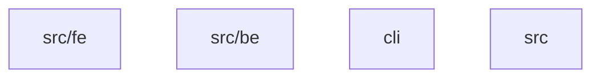

# Repository Documentation

## Purpose

This repository contains a modular software system organized into 4 modules with 158 components.

## Architecture Overview

The system is organized in a 0-level hierarchy:

## Module Structure

### [src/fe](modules/src/fe/README.md)
This module contains 10 components with a cohesion score of 80.0%. It manages resources and orchestrates operations.

### [src/be](modules/src/be/README.md)
This module contains 19 components with a cohesion score of 100.0%. It provides data analysis and parsing capabilities.

### [cli](modules/cli/README.md)
This module contains 12 components with a cohesion score of 77.78%. It manages resources and orchestrates operations.

### [src](modules/src/README.md)
This module contains 2 components with a cohesion score of 0.0%. It manages resources and orchestrates operations.

## Getting Started

Start by exploring the root modules:

- [src/fe](modules/src/fe/README.md)
- [src/be](modules/src/be/README.md)
- [cli](modules/cli/README.md)
- [src](modules/src/README.md)
