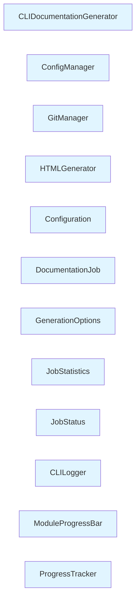

# Module: cli

## Overview

This module contains 12 components with a cohesion score of 77.78%. It manages resources and orchestrates operations.

## Architecture

The module is organized with the following structure:

- **Internal Dependencies**: 7 relationships between components
- **External Dependencies**: 2 relationships with other modules
- **High cohesion**: Components are closely related

## Components

### CLIDocumentationGenerator

**Type**: class
**File**: `gatowiki/cli/adapters/doc_generator.py`

**Purpose**: CLIDocumentationGenerator creates or constructs objects/data

**Internal Dependencies**:
- HTMLGenerator
- DocumentationJob
- ProgressTracker

**External Dependencies**:
- ColoredFormatter (src/be)
- APIError (None)
- DocumentationGenerator (src/be)
- set_cli_context (None)
- ensure_directory (None)
- cluster_modules (None)

### ConfigManager

**Type**: class
**File**: `gatowiki/cli/config_manager.py`

**Purpose**: ConfigManager manages lifecycle and resources

**Internal Dependencies**:
- Configuration

**External Dependencies**:
- safe_write (None)
- safe_read (None)
- ConfigurationError (None)
- ensure_directory (None)

### GitManager

**Type**: class
**File**: `gatowiki/cli/git_manager.py`

**Purpose**: GitManager manages lifecycle and resources

**External Dependencies**:
- RepositoryError (None)

### HTMLGenerator

**Type**: class
**File**: `gatowiki/cli/html_generator.py`

**Purpose**: HTMLGenerator creates or constructs objects/data

**External Dependencies**:
- FileSystemError (None)
- safe_write (None)
- load_module_tree (None)
- safe_read (None)

### Configuration

**Type**: class
**File**: `gatowiki/cli/models/config.py`

**Purpose**: Configuration manages configuration settings

**External Dependencies**:
- ConfigurationError (None)

### DocumentationJob

**Type**: class
**File**: `gatowiki/cli/models/job.py`

**Purpose**: DocumentationJob (class)

**Internal Dependencies**:
- JobStatus
- JobStatistics
- GenerationOptions

### GenerationOptions

**Type**: class
**File**: `gatowiki/cli/models/job.py`

**Purpose**: GenerationOptions represents data structure or entity

### JobStatistics

**Type**: class
**File**: `gatowiki/cli/models/job.py`

**Purpose**: JobStatistics represents data structure or entity

### JobStatus

**Type**: class
**File**: `gatowiki/cli/models/job.py`

**Purpose**: JobStatus represents data structure or entity

### CLILogger

**Type**: class
**File**: `gatowiki/cli/utils/logging.py`

**Purpose**: CLILogger represents data structure or entity

### ModuleProgressBar

**Type**: class
**File**: `gatowiki/cli/utils/progress.py`

**Purpose**: ModuleProgressBar represents data structure or entity

### ProgressTracker

**Type**: class
**File**: `gatowiki/cli/utils/progress.py`

**Purpose**: ProgressTracker represents data structure or entity

## External Dependencies

### src/be
- 2 relationship(s)

## Architectural Patterns

### Layered Pattern
- **Confidence**: 70%
- **Evidence**: Clear separation of concerns, Unidirectional dependencies

