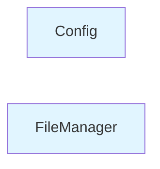

# Module: src

## Overview

This module contains 2 components with a cohesion score of 0.0%. It manages resources and orchestrates operations.

## Architecture

The module is organized with the following structure:

- **Low cohesion**: Components are relatively independent

## Components

### Config

**Type**: class
**File**: `gatowiki/src/config.py`

**Purpose**: Config manages configuration settings

### FileManager

**Type**: class
**File**: `gatowiki/src/utils.py`

**Purpose**: FileManager manages lifecycle and resources

