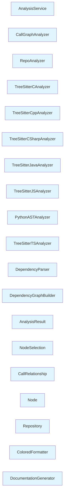

# Module: src/be

## Overview

This module contains 19 components with a cohesion score of 100.0%. It provides data analysis and parsing capabilities.

## Architecture

The module is organized with the following structure:

- **Internal Dependencies**: 22 relationships between components
- **High cohesion**: Components are closely related

## Components

### AnalysisService

**Type**: class
**File**: `gatowiki/src/be/dependency_analyzer/analysis/analysis_service.py`

**Purpose**: AnalysisService provides business logic and operations

**Internal Dependencies**:
- AnalysisResult
- RepoAnalyzer
- CallGraphAnalyzer
- Repository

**External Dependencies**:
- cleanup_repository (None)
- assert_safe_path (None)
- clone_repository (None)
- safe_open_text (None)
- warning (None)
- parse_github_url (None)

### CallGraphAnalyzer

**Type**: class
**File**: `gatowiki/src/be/dependency_analyzer/analysis/call_graph_analyzer.py`

**Purpose**: CallGraphAnalyzer analyzes or transforms data

**External Dependencies**:
- analyze_javascript_file_treesitter (None)
- analyze_csharp_file (None)
- analyze_typescript_file_treesitter (None)
- analyze_c_file (None)
- analyze_python_file (None)
- safe_open_text (None)
- warning (None)
- analyze_cpp_file (None)
- analyze_java_file (None)

### RepoAnalyzer

**Type**: class
**File**: `gatowiki/src/be/dependency_analyzer/analysis/repo_analyzer.py`

**Purpose**: RepoAnalyzer analyzes or transforms data

### TreeSitterCAnalyzer

**Type**: class
**File**: `gatowiki/src/be/dependency_analyzer/analyzers/c.py`

**Purpose**: TreeSitterCAnalyzer analyzes or transforms data

**Internal Dependencies**:
- Node
- CallRelationship

### TreeSitterCppAnalyzer

**Type**: class
**File**: `gatowiki/src/be/dependency_analyzer/analyzers/cpp.py`

**Purpose**: TreeSitterCppAnalyzer analyzes or transforms data

**Internal Dependencies**:
- Node
- CallRelationship

### TreeSitterCSharpAnalyzer

**Type**: class
**File**: `gatowiki/src/be/dependency_analyzer/analyzers/csharp.py`

**Purpose**: TreeSitterCSharpAnalyzer analyzes or transforms data

**Internal Dependencies**:
- Node
- CallRelationship

### TreeSitterJavaAnalyzer

**Type**: class
**File**: `gatowiki/src/be/dependency_analyzer/analyzers/java.py`

**Purpose**: TreeSitterJavaAnalyzer analyzes or transforms data

**Internal Dependencies**:
- Node
- CallRelationship

### TreeSitterJSAnalyzer

**Type**: class
**File**: `gatowiki/src/be/dependency_analyzer/analyzers/javascript.py`

**Purpose**: TreeSitterJSAnalyzer analyzes or transforms data

**Internal Dependencies**:
- Node
- CallRelationship

**External Dependencies**:
- warning (None)

### PythonASTAnalyzer

**Type**: class
**File**: `gatowiki/src/be/dependency_analyzer/analyzers/python.py`

**Purpose**: PythonASTAnalyzer analyzes or transforms data

**Internal Dependencies**:
- Node
- CallRelationship

**External Dependencies**:
- warning (None)

### TreeSitterTSAnalyzer

**Type**: class
**File**: `gatowiki/src/be/dependency_analyzer/analyzers/typescript.py`

**Purpose**: TreeSitterTSAnalyzer analyzes or transforms data

**Internal Dependencies**:
- Node
- CallRelationship

### DependencyParser

**Type**: class
**File**: `gatowiki/src/be/dependency_analyzer/ast_parser.py`

**Purpose**: DependencyParser analyzes or transforms data

**Internal Dependencies**:
- AnalysisService
- Node

### DependencyGraphBuilder

**Type**: class
**File**: `gatowiki/src/be/dependency_analyzer/dependency_graphs_builder.py`

**Purpose**: DependencyGraphBuilder creates or constructs objects/data

**Internal Dependencies**:
- DependencyParser

**External Dependencies**:
- build_graph_from_components (None)
- ensure_directory (None)
- get_leaf_nodes (None)
- warning (None)

### AnalysisResult

**Type**: class
**File**: `gatowiki/src/be/dependency_analyzer/models/analysis.py`

**Purpose**: AnalysisResult represents data structure or entity

### NodeSelection

**Type**: class
**File**: `gatowiki/src/be/dependency_analyzer/models/analysis.py`

**Purpose**: NodeSelection represents data structure or entity

### CallRelationship

**Type**: class
**File**: `gatowiki/src/be/dependency_analyzer/models/core.py`

**Purpose**: CallRelationship represents data structure or entity

### Node

**Type**: class
**File**: `gatowiki/src/be/dependency_analyzer/models/core.py`

**Purpose**: Node represents data structure or entity

### Repository

**Type**: class
**File**: `gatowiki/src/be/dependency_analyzer/models/core.py`

**Purpose**: Repository represents data structure or entity

### ColoredFormatter

**Type**: class
**File**: `gatowiki/src/be/dependency_analyzer/utils/logging_config.py`

**Purpose**: ColoredFormatter represents data structure or entity

### DocumentationGenerator

**Type**: class
**File**: `gatowiki/src/be/documentation_generator.py`

**Purpose**: DocumentationGenerator creates or constructs objects/data

**Internal Dependencies**:
- DependencyGraphBuilder

**External Dependencies**:
- ensure_directory (None)
- cluster_modules (None)
- info (None)

## Used By

### cli
- 2 relationship(s)

### src/fe
- 1 relationship(s)

## Architectural Patterns

### Layered Pattern
- **Confidence**: 70%
- **Evidence**: Clear separation of concerns, Unidirectional dependencies

