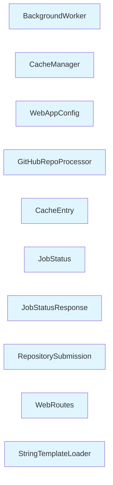

# Module: src/fe

## Overview

This module contains 10 components with a cohesion score of 80.0%. It manages resources and orchestrates operations.

## Architecture

The module is organized with the following structure:

- **Internal Dependencies**: 4 relationships between components
- **External Dependencies**: 1 relationships with other modules
- **High cohesion**: Components are closely related

## Components

### BackgroundWorker

**Type**: class
**File**: `gatowiki/src/fe/background_worker.py`

**Purpose**: BackgroundWorker (class)

**Internal Dependencies**:
- JobStatus

**External Dependencies**:
- DocumentationGenerator (src/be)
- clone_repository (None)

### CacheManager

**Type**: class
**File**: `gatowiki/src/fe/cache_manager.py`

**Purpose**: CacheManager manages lifecycle and resources

**Internal Dependencies**:
- CacheEntry

### WebAppConfig

**Type**: class
**File**: `gatowiki/src/fe/config.py`

**Purpose**: WebAppConfig manages configuration settings

### GitHubRepoProcessor

**Type**: class
**File**: `gatowiki/src/fe/github_processor.py`

**Purpose**: GitHubRepoProcessor processes data or handles events

### CacheEntry

**Type**: class
**File**: `gatowiki/src/fe/models.py`

**Purpose**: CacheEntry represents data structure or entity

### JobStatus

**Type**: class
**File**: `gatowiki/src/fe/models.py`

**Purpose**: JobStatus represents data structure or entity

### JobStatusResponse

**Type**: class
**File**: `gatowiki/src/fe/models.py`

**Purpose**: JobStatusResponse represents data structure or entity

### RepositorySubmission

**Type**: class
**File**: `gatowiki/src/fe/models.py`

**Purpose**: RepositorySubmission represents data structure or entity

### WebRoutes

**Type**: class
**File**: `gatowiki/src/fe/routes.py`

**Purpose**: WebRoutes (class)

**Internal Dependencies**:
- JobStatusResponse
- JobStatus

**External Dependencies**:
- markdown_to_html (None)
- get_file_title (None)
- render_template (None)
- get_job_status (None)

### StringTemplateLoader

**Type**: class
**File**: `gatowiki/src/fe/template_utils.py`

**Purpose**: StringTemplateLoader represents data structure or entity

## External Dependencies

### src/be
- 1 relationship(s)

## Architectural Patterns

### Layered Pattern
- **Confidence**: 70%
- **Evidence**: Clear separation of concerns, Unidirectional dependencies

