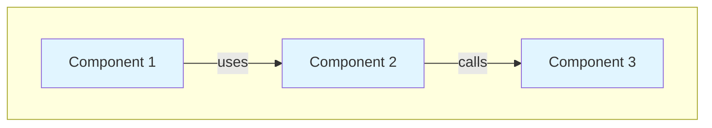
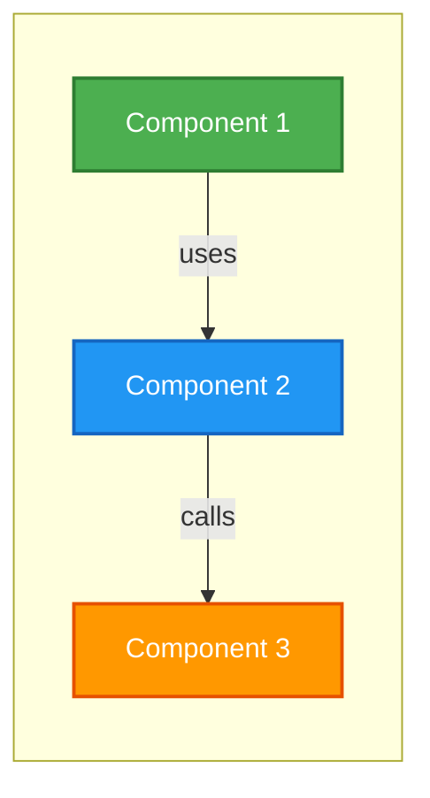
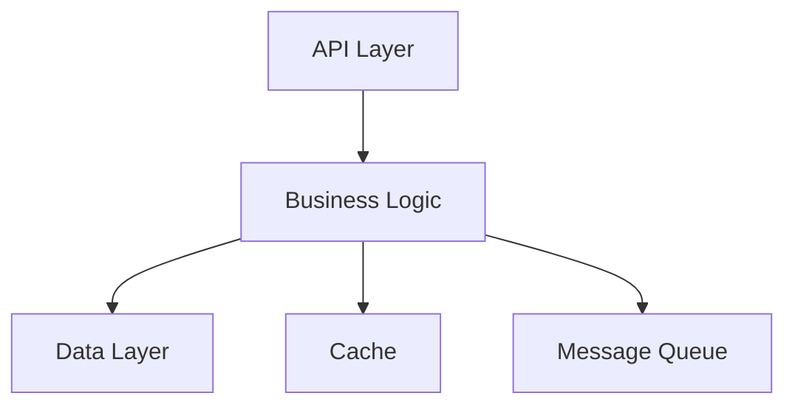

# Agent Customization Guide

## Overview

GatoWiki's GitHub Copilot agents are fully customizable through markdown definition files. This guide explains how to modify agent behavior, create custom prompt templates, and adapt GatoWiki to your team's documentation standards.

---

## Agent Files Structure

```
.github/
├── agents/
│   ├── gatowiki-orchestrator.agent.md    # Complex module orchestration
│   └── gatowiki-leaf.agent.md            # Simple module documentation
└── prompts/
    ├── gatowiki-orchestrator.prompt.md    # Prompt link to orchestrator agent
    ├── gatowiki-leaf.prompt.md            # Prompt link to leaf agent
    └── gatowiki.prompt.md                 # Reusable prompt templates
```

---

## Common Customizations

### 1. Adjust Complexity Threshold

**Default:** Modules with > 10 components are considered complex

**Location:** `.github/agents/gatowiki-orchestrator.agent.md`

**Find this section:**
```markdown
## Module Complexity Threshold

**Simple Module** (delegate to leaf agent):
- Has ≤ 10 core components, OR
- All components are in a single file, OR
- Token count of component code < 4000 tokens
```

**Customize:**
```markdown
## Module Complexity Threshold

**Simple Module** (delegate to leaf agent):
- Has ≤ 15 core components, OR         # ← Changed from 10
- All components are in a single file, OR
- Token count of component code < 6000 tokens  # ← Changed from 4000
```

**Effect:** More modules will be handled by the leaf agent, reducing recursion depth.

---

### 2. Change Documentation Structure

**Default:** Standard sections (Overview, Architecture, Components, etc.)

**Location:** `.github/agents/gatowiki-leaf.agent.md`

**Find this section:**
```markdown
## Documentation Template

Generate documentation following this structure:

```markdown
# Module: <module_name>

## Overview
[High-level description of the module's purpose and responsibilities]

## Architecture
```mermaid
...
```

## Components
...
```
```

**Customize - Add Quick Start Section:**
```markdown
## Documentation Template

Generate documentation following this structure:

```markdown
# Module: <module_name>

## Quick Start                           # ← NEW SECTION
[3-5 lines showing how to use this module immediately]

```python
from module_name import MainClass
instance = MainClass()
instance.do_something()
```

## Overview
[High-level description of the module's purpose and responsibilities]

## Architecture
...
```
```

**Effect:** All generated documentation will include a Quick Start section at the top.

---

### 3. Modify Recursion Depth

**Default:** Maximum recursion depth is 3 levels

**Location:** `.github/agents/gatowiki-orchestrator.agent.md`

**Find this section:**
```markdown
**Recursion Depth Limit**: Default maximum depth is 3 levels. Stop recursion at max depth and treat remaining modules as leaf modules.
```

**Customize:**
```markdown
**Recursion Depth Limit**: Maximum depth is 5 levels. Stop recursion at max depth and treat remaining modules as leaf modules.
```

**Effect:** Allows deeper module hierarchies before falling back to leaf agent processing.

---

### 4. Customize Mermaid Diagram Style

**Default:** Standard Mermaid syntax

**Location:** `.github/agents/gatowiki-leaf.agent.md`

**Find this section:**
```markdown

```

**Customize - Different Colors & Style:**
```markdown

```

**Effect:** Generated diagrams will use your custom color scheme and styling.

---

### 5. Add Team-Specific Sections

**Location:** `.github/agents/gatowiki-leaf.agent.md`

**In the "Required Sections" list, add:**

```markdown
**Required Sections**:
1. **Module Overview** - Purpose, responsibilities, key concepts
2. **Architecture** - Mermaid diagram showing component structure
3. **Components** - Detailed description of each component
4. **Interactions** - How components work together
5. **Dependencies** - Internal and external dependencies
6. **Usage Examples** - Code examples showing how to use the module
7. **Security Considerations** - Security implications and best practices  # ← NEW
8. **Monitoring & Observability** - Metrics, logs, traces              # ← NEW
```

**Effect:** Every generated documentation file will include Security and Monitoring sections.

---

## Advanced Customizations

### Custom Prompt Templates

**Location:** `.github/prompts/gatowiki.prompt.md`

**Add a new template:**

```markdown
## API Endpoint Documentation

Generate REST API documentation for an endpoint module.

Context needed:
- Endpoint path and HTTP methods
- Request/response schemas
- Authentication requirements
- Rate limiting rules

Output format:
- **Endpoint**: `<method> <path>`
- **Description**: [Purpose of endpoint]
- **Authentication**: [Required auth type]
- **Request**:
  ```json
  {schema}
  ```
- **Response**:
  ```json
  {schema}
  ```
- **Examples**: [cURL examples]
- **Rate Limits**: [Limits and throttling]
```

**Usage in Copilot Chat:**
```
Use the "API Endpoint Documentation" template to document the auth endpoint module
```

---

### Organization-Specific Terminology

**Location:** `.github/agents/gatowiki-orchestrator.agent.md` or `gatowiki-leaf.agent.md`

**Add a glossary section at the top:**

```markdown
## Terminology

Use these organization-specific terms in documentation:

- **Service** instead of "Module" for microservices
- **Handler** instead of "Controller" for request handlers
- **Repository** instead of "DAO" for data access
- **Entity** instead of "Model" for domain objects
- **Adapter** instead of "Integration" for external services

Always use these terms consistently throughout documentation.
```

---

### Language-Specific Customization

Create language-specific agent variants:

**Location:** `.github/agents/gatowiki-python.agent.md`

```markdown
# GatoWiki Python Leaf Agent

Extends the base leaf agent with Python-specific conventions.

## Python Documentation Standards

### Docstring Format
Use Google-style docstrings:
```python
def function(arg1: str, arg2: int) -> bool:
    """Short description.
    
    Longer description if needed.
    
    Args:
        arg1: Description of arg1
        arg2: Description of arg2
        
    Returns:
        Description of return value
        
    Raises:
        ValueError: When validation fails
    """
```

### Type Hints
Always show type hints in documentation examples.

### Module Structure
Document Python modules with this structure:
1. Module-level docstring
2. Imports section
3. Constants
4. Classes
5. Functions
6. Main block (if applicable)
```

---

## Customization Examples

### Example 1: Microservices Documentation

**Scenario:** Your team builds microservices and needs service-specific documentation structure.

**Solution:** Customize `.github/agents/gatowiki-leaf.agent.md`:

```markdown
## Documentation Template (Microservices)

```markdown
# Service: <service_name>

## Service Overview
[Purpose, domain responsibility, bounded context]

## API Endpoints
### POST /endpoint
[Endpoint details]

### GET /endpoint
[Endpoint details]

## Architecture


## Data Models
[Domain entities and DTOs]

## Dependencies
### Internal Services
- [Service 1]: [Purpose]
- [Service 2]: [Purpose]

### External Services
- [AWS S3]: [Usage]
- [PostgreSQL]: [Schema]

## Deployment
[Docker, Kubernetes, env vars]

## Monitoring
- **Metrics**: [Key metrics]
- **Logs**: [Log format]
- **Alerts**: [Alert conditions]
```
```

---

### Example 2: Open Source Project Documentation

**Scenario:** You maintain an open source project and need contributor-friendly docs.

**Solution:** Customize `.github/agents/gatowiki-leaf.agent.md`:

```markdown
## Documentation Template (Open Source)

```markdown
# Module: <module_name>

## Quick Start
[Immediate usage example]

## Overview
[What this module does]

## Architecture
[Mermaid diagram]

## Components
### Component 1
- **Purpose**: [What it does]
- **API**: [Key methods]
- **Example**: [Code snippet]

## Interactions
[How components work together]

## Dependencies
- [Dependency 1]: [Why needed]
- [Dependency 2]: [Why needed]

## Usage Examples
### Basic Usage
```python
[Simple example]
```

### Advanced Usage
```python
[Complex example]
```

## Contributing
[How to contribute to this module]

## Testing
```bash
pytest tests/test_<module_name>.py
```

## License
[License info if module-specific]
```
```

---

### Example 3: Enterprise Documentation with Compliance

**Scenario:** Enterprise environment requiring compliance sections.

**Solution:** Customize `.github/agents/gatowiki-orchestrator.agent.md`:

```markdown
## Documentation Structure (Enterprise)

Generate documentation with these required sections:

**Mandatory Enterprise Sections**:
1. **Module Overview** - Standard overview
2. **Architecture** - With security boundaries highlighted
3. **Components** - With data classification
4. **Security & Compliance**:
   - Data sensitivity level (Public/Internal/Confidential)
   - PII handling procedures
   - Regulatory compliance (GDPR, SOC2, HIPAA, etc.)
   - Security controls implemented
5. **Audit & Logging**:
   - What events are logged
   - Log retention policy
   - Audit trail availability
6. **Dependencies** - With security risk assessment
7. **Change Control** - Change approval process
8. **Incident Response** - Module-specific incident procedures

**Example Security Section**:
```markdown
## Security & Compliance

**Data Classification**: Confidential
**PII Handled**: Yes (email addresses, names)
**Regulatory Compliance**: GDPR, SOC2

**Security Controls**:
- Encryption at rest (AES-256)
- Encryption in transit (TLS 1.3)
- Access control (RBAC)
- Input validation and sanitization

**PII Handling**:
- Data minimization applied
- Consent collected before processing
- Right to deletion implemented
- Data retention: 2 years
```
```

---

## 🔍 Testing Your Customizations

### 1. Test on Small Module

```bash
# Run analysis
gatowiki analyze --output ./test-docs

# Open Copilot Chat
# Ask: "Document the config_manager module using the customized template"

# Review generated docs
cat test-docs/config_manager.md
```

### 2. Validate Mermaid Diagrams

```bash
# Install mermaid-cli
npm install -g @mermaid-js/mermaid-cli

# Validate diagram syntax
mmdc -i docs/module.md -o /dev/null
```

### 3. Check Cross-References

```bash
# Ensure all internal links are valid
grep -r "\[.*\](.*\.md)" docs/ | while read link; do
  # Extract file path
  # Verify file exists
done
```

---

## Customization Checklist

Before deploying custom agents to your team:

- [ ] Test on small repository (< 10K LOC)
- [ ] Verify all sections appear in generated docs
- [ ] Validate Mermaid diagram syntax
- [ ] Check cross-references between modules
- [ ] Review with team for consistency
- [ ] Document customizations in team wiki
- [ ] Version control agent definitions
- [ ] Create rollback procedure

---

## Sharing Customizations

### Within Your Team

**1. Commit to Repository**
```bash
git add .github/agents/*.agent.md
git add .github/prompts/*.prompt.md
git commit -m "feat: customize GatoWiki agents for team standards"
git push
```

**2. Document Changes**

Create `.github/agents/README.md`:
```markdown
# Team GatoWiki Agent Customizations

## Changes from Default

1. **Complexity Threshold**: Increased from 10 to 15 components
2. **Required Sections**: Added Security and Monitoring sections
3. **Mermaid Style**: Custom color scheme (green/blue/orange)

## Testing

Test customizations with:
```bash
gatowiki analyze --output ./test
# Then ask Copilot to document a module
```

## Rollback

To revert to defaults:
```bash
git checkout origin/main -- .github/agents/
```
```

### With the Community

Share successful patterns on GitHub:

1. Fork GatoWiki repository
2. Add your custom agent to `templates/agents/custom/`
3. Create PR with description of use case
4. Tag with `enhancement`, `agent-customization`

---

## Troubleshooting Customizations

### Issue: Agent Ignores Custom Sections

**Cause**: Copilot Chat might not parse the modified template correctly.

**Solution**:
1. Ensure markdown syntax is valid
2. Keep template structure clear and unambiguous
3. Add explicit instructions:
   ```markdown
   **IMPORTANT**: Always include the following sections in this exact order:
   1. Overview
   2. Quick Start (NEW - always include)
   3. Architecture
   ...
   ```

### Issue: Mermaid Diagrams Don't Render

**Cause**: Syntax errors in customized Mermaid template.

**Solution**:
```bash
# Validate syntax with mermaid-cli
mmdc -i diagram.mmd -o diagram.png

# Or use online editor: https://mermaid.live
```

### Issue: Recursion Depth Changes Don't Take Effect

**Cause**: Agent definition not reloaded.

**Solution**:
1. Restart your IDE (VS Code, IntelliJ, etc.)
2. Reload Copilot Chat
3. Explicitly reference the agent:
   ```
   @gatowiki-orchestrator please use updated recursion depth
   ```

---

## Best Practices

### 1. Start Small
- Customize one agent at a time
- Test on small modules first
- Gradually increase complexity

### 2. Document Everything
- Comment your customizations in agent files
- Maintain a changelog
- Share rationale with team

### 3. Version Control
```bash
# Tag agent versions
git tag -a agents-v1.0 -m "Initial custom agents"
git push origin agents-v1.0

# Track changes
git log .github/agents/ --oneline
```

### 4. Maintain Consistency
- Keep orchestrator and leaf agent styles aligned
- Use same terminology across all agents
- Synchronize changes to both agents

### 5. Regular Reviews
- Review generated docs monthly
- Gather team feedback
- Iterate on customizations

---

## Additional Resources

- [Agent Schema Reference](https://docs.github.com/en/copilot/building-copilot-extensions/building-a-copilot-agent-for-your-copilot-extension/configuring-your-copilot-agent-to-communicate-with-github-copilot) - Official GitHub Copilot agent documentation
- [Mermaid Documentation](https://mermaid.js.org/) - Diagram syntax reference
- [Markdown Guide](https://www.markdownguide.org/) - Markdown formatting reference
- [GatoWiki Examples](../README.md#documentation-output) - Example generated documentation

---

## Contributing Your Customizations

We welcome community contributions! Share your agent customizations:

1. **Template Repository**: Fork and add to `templates/agents/custom/`
2. **Use Case Description**: Explain what problem it solves
3. **Example Output**: Show before/after documentation samples
4. **Testing Instructions**: How others can test your customization

**Example PR Title**: "feat: add API-first documentation template for REST services"

---

## FAQ

### Q: Can I have multiple agent variants?

**A:** Yes! Create separate agent files:
- `.github/agents/gatowiki-python.agent.md`
- `.github/agents/gatowiki-java.agent.md`
- `.github/agents/gatowiki-microservices.agent.md`

Then reference them explicitly in Copilot Chat:
```
@gatowiki-python please document this module
```

### Q: How do I reset to defaults?

**A:** 
```bash
# Get default agents from GatoWiki repository
curl -o .github/agents/gatowiki-orchestrator.agent.md \
  https://raw.githubusercontent.com/FSoft-AI4Code/GatoWiki/main/.github/agents/gatowiki-orchestrator.agent.md

curl -o .github/agents/gatowiki-leaf.agent.md \
  https://raw.githubusercontent.com/FSoft-AI4Code/GatoWiki/main/.github/agents/gatowiki-leaf.agent.md
```

### Q: Do I need to update agents when GatoWiki updates?

**A:** Not necessarily. Your customizations will continue to work. However:
- Check release notes for new features
- Consider adopting improvements from new defaults
- Test compatibility after major updates

### Q: Can I use different agents for different projects?

**A:** Yes! Agent definitions are repository-specific. Each project can have its own `.github/agents/` directory with customized agents.

---

**Last Updated**: 2025-12-09 | **GatoWiki Version**: 2.0.0
