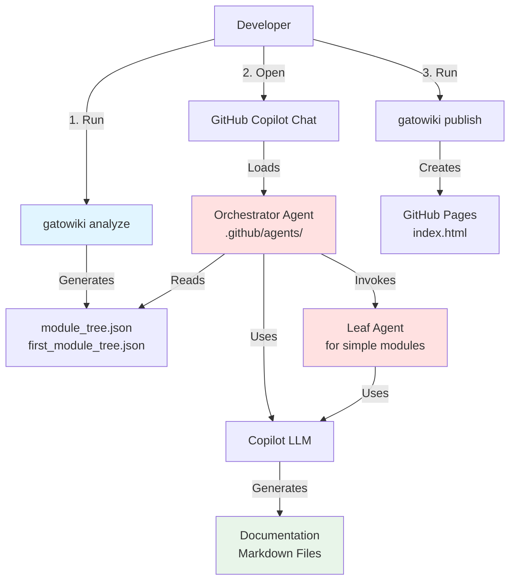
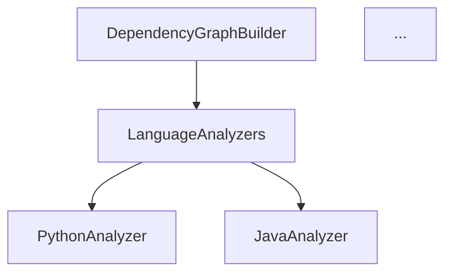

# GitHub Copilot Integration Guide

## Overview

GatoWiki v0.25.5 integrates seamlessly with GitHub Copilot through intelligent agents that orchestrate repository documentation generation. This guide explains the complete workflow from setup to documentation publishing.

---

## Prerequisites

### Required
- ✅ **GitHub Copilot Subscription** (Individual, Business, or Enterprise)
- ✅ **GatoWiki v0.25.5+** installed (`pip install gatowiki`)
- ✅ **IDE with Copilot support** (VS Code, IntelliJ IDEA, Visual Studio, Vim, etc.)
- ✅ **Python 3.12+**

### Optional
- Git repository for documentation publishing
- GitHub Pages for hosting documentation

---

## Quick Start

```bash
# Navigate to your repository
cd your-repository
```

Open **GitHub Copilot Chat** and say:

```
Generate documentation
```

That's it! The agent will:
1. Automatically run `gatowiki analyze` if needed
2. Generate comprehensive docs for all modules
3. Create architecture diagrams
4. Write files to `./docs/`

**Optional: Publish to GitHub Pages**
```bash
gatowiki publish --github-pages --create-branch
```

---

## Complete Workflow

### Architecture Overview



---

## 🔧 Step 1: Setup & Configuration

### Install GatoWiki

```bash
# Install from GitHub
pip install git+https://github.com/eitatech/gatomia-wiki.git

# Verify installation
gatowiki --version  # Should show 2.0.0+
```

### Configure Output Directory (Optional)

```bash
# Set default output directory
gatowiki config set --output ./docs

# View current configuration
gatowiki config show
```

### Verify GitHub Copilot

Ensure GitHub Copilot is enabled in your IDE:

**VS Code:**
1. Install "GitHub Copilot" and "GitHub Copilot Chat" extensions
2. Sign in with your GitHub account
3. Open Copilot Chat panel (Ctrl+Shift+I or Cmd+Shift+I)

**IntelliJ IDEA:**
1. Install "GitHub Copilot" plugin
2. Sign in with your GitHub account
3. Open Copilot Chat window

---

## 🔍 Step 2: Run Code Analysis

### Basic Usage

```bash
cd /path/to/your/repository
gatowiki analyze
```

### Advanced Options

```bash
# Custom output directory
gatowiki analyze --output ./documentation

# Verbose output
gatowiki analyze --verbose

# Filter by languages
gatowiki analyze --languages python,typescript

# Limit module depth
gatowiki analyze --max-depth 3

# Combined options
gatowiki analyze \
  --output ./docs \
  --verbose \
  --languages python,java \
  --max-depth 4
```

### What Analysis Does

The `analyze` command performs:

1. **Dependency Graph Construction**
   - Parses source code using Tree-sitter
   - Builds cross-file dependency relationships
   - Identifies leaf nodes and module boundaries

2. **Module Clustering**
   - Groups related components into modules
   - Creates hierarchical module structure
   - Preserves architectural relationships

3. **Output Generation**
   - `module_tree.json` - Hierarchical module structure
   - `first_module_tree.json` - Initial clustering result
   - `analysis_metadata.json` - Analysis statistics

### Expected Output

```
Building dependency graph...
✓ Found 1247 components with 523 leaf nodes
Clustering modules...
✓ Grouped components into 12 modules

Code analysis completed successfully!
📁 Analysis files saved to: ./docs
   - first_module_tree.json
   - module_tree.json
   - analysis_metadata.json

Next steps:
   1. Use GitHub Copilot Chat to generate documentation
   2. Refer to .github/agents/gatowiki-orchestrator.agent.md
   3. Run 'gatowiki publish' to generate GitHub Pages
```

---

## Step 3: Generate Documentation with Copilot

### The GatoWiki Agent

GatoWiki uses a single intelligent agent:

**GatoWiki Agent** (`.github/agents/gatowiki.agent.md`)
- Automatically analyzes repository if needed
- Detects all modules in the codebase
- Generates comprehensive documentation for each
- Creates architecture diagrams
- Handles both simple and complex modules

### Starting Documentation Generation

Open GitHub Copilot Chat and use simple commands:

```
Generate documentation              # Full repository
Update documentation                # Skip existing docs
Document the cli module             # Single module
Regenerate all documentation        # Overwrite all
```

The orchestrator agent will:
1. Check if `docs/module_tree.json` exists
2. Run `gatowiki analyze` automatically if missing or empty
3. Process each module and generate documentation
4. Write markdown files directly to `docs/`
5. Update `module_tree.json` with documentation paths

### Advanced Prompts (Optional)

#### Option 1: Full Repository Documentation

```
Generate comprehensive documentation for this repository using the GatoWiki orchestrator agent.
Start with the module tree in ./docs/module_tree.json and process all modules.
```

#### Option 2: Specific Module Documentation

```
Generate documentation for the [module_name] module using the GatoWiki leaf agent.
The module structure is in ./docs/module_tree.json.
```

#### Option 3: Progressive Documentation

```
I've run gatowiki analyze. Please help me generate documentation module by module, 
starting with the leaf modules in the dependency tree.
```

### Agent Interaction Examples

#### Example 1: Repository Overview

**You:**
```
Generate documentation for the GatoWiki repository
```

**Orchestrator Agent:**
```
✓ Reading module tree from ./docs/module_tree.json
✓ Found 12 modules to document

I'll start with leaf modules first, then work up to parent modules:

Processing: cli_models (leaf module)
- Reading source files...
- Generating documentation...
✓ Created docs/cli_models.md

Processing: dependency_analyzer (complex module with 3 sub-modules)
- Delegating to sub-modules first...
  ✓ analyzers
  ✓ parsers  
  ✓ utils
- Synthesizing module documentation...
✓ Created docs/dependency_analyzer.md

[Continues for all modules...]

✅ Documentation generation complete!
📚 Generated 12 module documentation files
```

#### Example 2: Single Module Focus

**You:**
```
Document just the 'config_manager' module
```

**Leaf Agent:**
```
✓ Reading module info from ./docs/module_tree.json
✓ Module has 2 components (config_manager.py, config.py)

Reading source files:
- gatowiki/cli/config_manager.py
- gatowiki/cli/models/config.py

Analyzing:
- ConfigManager class
- Config model
- Keychain integration

Generating documentation with:
- Module overview
- Component descriptions
- Architecture diagram
- Usage examples

✓ Created docs/config_manager.md
```

### Monitoring Progress

The agents will show their progress in Copilot Chat:
- ✓ Files being read
- ✓ Components being analyzed
- ✓ Documentation sections being generated
- ✓ Files being written

You can interrupt at any time to:
- Review generated content
- Request modifications
- Skip modules
- Change documentation style

---

## 📝 Step 4: Review & Refine Documentation

### Generated Files

After documentation generation, your `./docs/` directory will contain:

```
docs/
├── overview.md                 # Repository-level documentation
├── module1.md                  # Module-specific docs
├── module2.md
├── ...
├── module_tree.json            # Module hierarchy (from analysis)
├── first_module_tree.json      # Initial clustering (from analysis)
└── analysis_metadata.json      # Analysis stats (from analysis)
```

### Reviewing Documentation

Open any generated `.md` file to review:

```markdown
# Module: dependency_analyzer

## Overview
The dependency analyzer module is responsible for...

## Architecture


## Components
...
```

### Refining with Copilot

Request modifications through Copilot Chat:

```
The documentation for 'config_manager' module is too technical. 
Can you make it more beginner-friendly?
```

```
Add more code examples to the 'dependency_analyzer' documentation
```

```
The architecture diagram in 'agent_orchestrator' is too complex. 
Simplify it to show only the main components.
```

---

## 🌐 Step 5: Publish to GitHub Pages

### Generate HTML Viewer

```bash
gatowiki publish --github-pages
```

This creates an interactive HTML viewer at `./docs/index.html`.

### Create GitHub Pages Branch

```bash
gatowiki publish --github-pages --create-branch
```

This:
1. Generates `index.html`
2. Creates `gh-pages` branch
3. Pushes documentation files
4. Sets up GitHub Pages

### Enable GitHub Pages

1. Go to your repository on GitHub
2. Navigate to **Settings** → **Pages**
3. Select source: `gh-pages` branch, `/ (root)` folder
4. Click **Save**
5. Your documentation will be live at: `https://username.github.io/repository/`

### Local Preview

Open `./docs/index.html` in your browser to preview before publishing.

---

## 🛠️ Advanced Usage

### Custom Agent Behavior

#### Modify Complexity Threshold

Edit `.github/agents/gatowiki-orchestrator.agent.md`:

```markdown
## Module Complexity Threshold
- Default: 10 components
- Custom: 15 components  # ← Change this

When processing modules:
- If module has > 15 components: Process as complex module
- If module has ≤ 15 components: Process as simple module
```

#### Custom Documentation Template

Edit `.github/agents/gatowiki-leaf.agent.md`:

```markdown
## Documentation Template
```markdown
# Module: {module_name}

## Quick Start  # ← Add new section
[Brief getting started guide]

## Overview
[Existing content...]
```
```

### Using Prompt Templates

Prompt templates in `.github/prompts/gatowiki.prompt.md` provide reusable patterns:

```
Use the "Module Overview Generation" prompt template to document the 'api' module
```

### Batch Processing

Process multiple repositories:

```bash
#!/bin/bash
for repo in repo1 repo2 repo3; do
  cd $repo
  gatowiki analyze --output ./docs
  # Then use Copilot Chat to generate docs
  gatowiki publish --github-pages
  cd ..
done
```

---

## 🐛 Troubleshooting

### Issue: Agent Not Responding

**Symptoms:**
- Copilot Chat doesn't recognize GatoWiki commands
- No response when mentioning agents

**Solutions:**

1. **Verify agent files exist:**
   ```bash
   ls -la .github/agents/
   # Should show: gatowiki-orchestrator.agent.md, gatowiki-leaf.agent.md
   ```

2. **Reload IDE:**
   - Restart your IDE (VS Code, IntelliJ, etc.)
   - Reopen Copilot Chat

3. **Check Copilot status:**
   - Ensure Copilot is enabled in IDE settings
   - Verify GitHub Copilot subscription is active

4. **Reference agent explicitly:**
   ```
   @gatowiki-orchestrator please generate documentation
   ```

### Issue: Analysis Fails

**Error:** `Module tree not found`

**Solution:**
```bash
# Ensure you're in the repository root
cd /path/to/repository

# Run analysis with verbose output
gatowiki analyze --verbose

# Check for output files
ls -la docs/
```

**Error:** `No supported languages found`

**Solution:**
```bash
# Check supported languages
gatowiki analyze --help  # See --languages option

# Your repository might not contain supported file types
# Supported: .py, .java, .js, .ts, .c, .cpp, .cs
```

### Issue: Documentation Quality Issues

**Problem:** Generated docs are too shallow

**Solution:**
```
The documentation seems superficial. Please add more detail about:
1. Internal implementation details
2. Design decisions and trade-offs
3. Common pitfalls and best practices
```

**Problem:** Too much technical jargon

**Solution:**
```
This documentation is too technical for new contributors. 
Please rewrite it with:
- Simpler language
- More examples
- Step-by-step explanations
```

### Issue: Publishing Fails

**Error:** `Uncommitted changes detected`

**Solution:**
```bash
# Commit your changes first
git add .
git commit -m "Add documentation"

# Then publish
gatowiki publish --github-pages --create-branch
```

**Error:** `gh-pages branch already exists`

**Solution:**
```bash
# Delete existing branch
git branch -D gh-pages
git push origin --delete gh-pages

# Recreate
gatowiki publish --github-pages --create-branch
```

---

## 💡 Best Practices

### 1. Start with Analysis

Always run `gatowiki analyze` before asking Copilot to generate docs:
```bash
gatowiki analyze --verbose
```

### 2. Review Module Tree

Inspect `module_tree.json` to understand your codebase structure:
```bash
cat docs/module_tree.json | jq .
```

### 3. Progressive Documentation

Don't try to document everything at once. Start with core modules:
```
Let's start with the most important module: [module_name]
Generate documentation for it first.
```

### 4. Iterate on Quality

Request improvements after initial generation:
```
Review the generated documentation and suggest improvements
```

### 5. Keep Agents Updated

Periodically update agent definitions from the GatoWiki repository:
```bash
cp .github/agents/*.agent.md .github/agents/
git commit -m "Update GatoWiki agents"
```

### 6. Version Documentation

Tag documentation releases:
```bash
git tag -a docs-v1.0 -m "Documentation v1.0"
git push origin docs-v1.0
```

### 7. Automate Analysis in CI/CD

Run analysis automatically on every commit:
```yaml
# .github/workflows/analyze.yml
name: GatoWiki Analysis
on: [push]
jobs:
  analyze:
    runs-on: ubuntu-latest
    steps:
      - uses: actions/checkout@v3
      - run: pip install gatowiki
      - run: gatowiki analyze --output ./docs
      - uses: actions/upload-artifact@v3
        with:
          name: analysis
          path: docs/*.json
```

---

## 📚 Example Workflows

### Workflow 1: New Project Documentation

```bash
# 1. Initialize repository
cd my-new-project
git init

# 2. Add GatoWiki agent definitions
mkdir -p .github/agents
cp ~/gatowiki-templates/agents/* .github/agents/

# 3. Run analysis
gatowiki analyze --verbose

# 4. Generate docs with Copilot
# Open Copilot Chat: "Generate complete documentation"

# 5. Publish
gatowiki publish --github-pages --create-branch
```

### Workflow 2: Update Existing Documentation

```bash
# 1. Re-run analysis (code has changed)
gatowiki analyze --output ./docs

# 2. Ask Copilot to update specific modules
# "Update documentation for the 'auth' module based on new module_tree.json"

# 3. Review changes
git diff docs/

# 4. Re-publish
gatowiki publish --github-pages
git add docs/ && git commit -m "Update documentation"
```

### Workflow 3: Multilingual Documentation

```bash
# 1. Analyze Python and TypeScript code
gatowiki analyze --languages python,typescript

# 2. Ask Copilot to organize by language
# "Generate separate documentation sections for Python and TypeScript modules"

# 3. Publish with language navigation
gatowiki publish --github-pages
```

---

## 🔗 Integration with Other Tools

### VS Code Integration

Add to `.vscode/settings.json`:
```json
{
  "copilot.enable": {
    "*": true,
    "markdown": true,
    "python": true
  },
  "files.associations": {
    "*.agent.md": "markdown",
    "*.prompt.md": "markdown"
  }
}
```

### IntelliJ IDEA Integration

Enable Copilot for Markdown files in Settings → GitHub Copilot.

### Command Line Integration

Add to `.bashrc` or `.zshrc`:
```bash
alias cw-analyze='gatowiki analyze --verbose'
alias cw-publish='gatowiki publish --github-pages'
alias cw-docs='open docs/index.html'  # macOS
```

---

## 📊 Metrics & Analytics

### Track Documentation Coverage

```bash
# Count documented modules
documented=$(find docs -name "*.md" ! -name "overview.md" | wc -l)

# Count total modules
total=$(cat docs/module_tree.json | jq '[.. | objects | select(has("name"))] | length')

echo "Documentation coverage: $documented / $total modules"
```

### Analyze Documentation Quality

Use Copilot Chat to review:
```
Analyze the documentation quality in ./docs/
Provide metrics for:
1. Completeness (all sections present)
2. Clarity (readability scores)
3. Examples (code sample coverage)
4. Diagrams (visual aid presence)
```

---

## 🤝 Contributing

### Improve Agent Definitions

Submit improvements to agent definitions:

1. Edit `.github/agents/*.agent.md`
2. Test with your repositories
3. Share successful patterns with the community

### Share Prompt Templates

Create custom prompt templates:

```markdown
# My Custom Prompt Template

## API Documentation Generation
Generate API documentation with OpenAPI spec...
```

---

## 📖 Additional Resources

- [Migration Guide](./migration-to-github-copilot.md) - Migrate from v1.x
- [Agent Customization Guide](./customizing-agents.md) - Customize agents
- [Main README](../README.md) - Quick start guide
- [GitHub Copilot Docs](https://docs.github.com/en/copilot) - Official Copilot documentation

---

## ❓ FAQ

### Q: Do I need internet connection?

**A:** Yes, GitHub Copilot requires internet for LLM access. The `analyze` command works offline.

### Q: How much does GitHub Copilot cost?

**A:** See [GitHub Copilot pricing](https://github.com/features/copilot#pricing). Individual: $10/month, Business: $19/user/month.

### Q: Can I use this without Copilot?

**A:** No, v0.25.5 requires GitHub Copilot. For standalone usage, use GatoWiki v1.x.

### Q: How long does documentation generation take?

**A:** Depends on repository size:
- Small (< 10K LOC): 5-10 minutes
- Medium (10K-100K LOC): 15-30 minutes  
- Large (100K-1M LOC): 30-60 minutes

### Q: Can I customize documentation style?

**A:** Yes! Edit agent definitions in `.github/agents/` or provide style preferences in Copilot Chat.

---

**Last Updated**: 2025-12-09 | **GatoWiki Version**: 2.0.0
