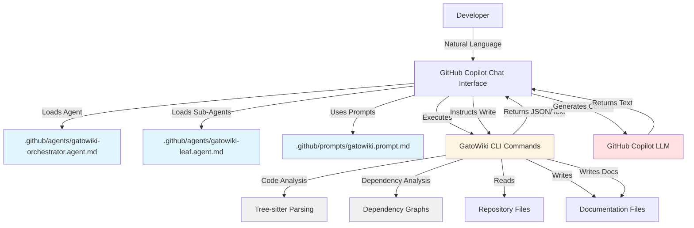
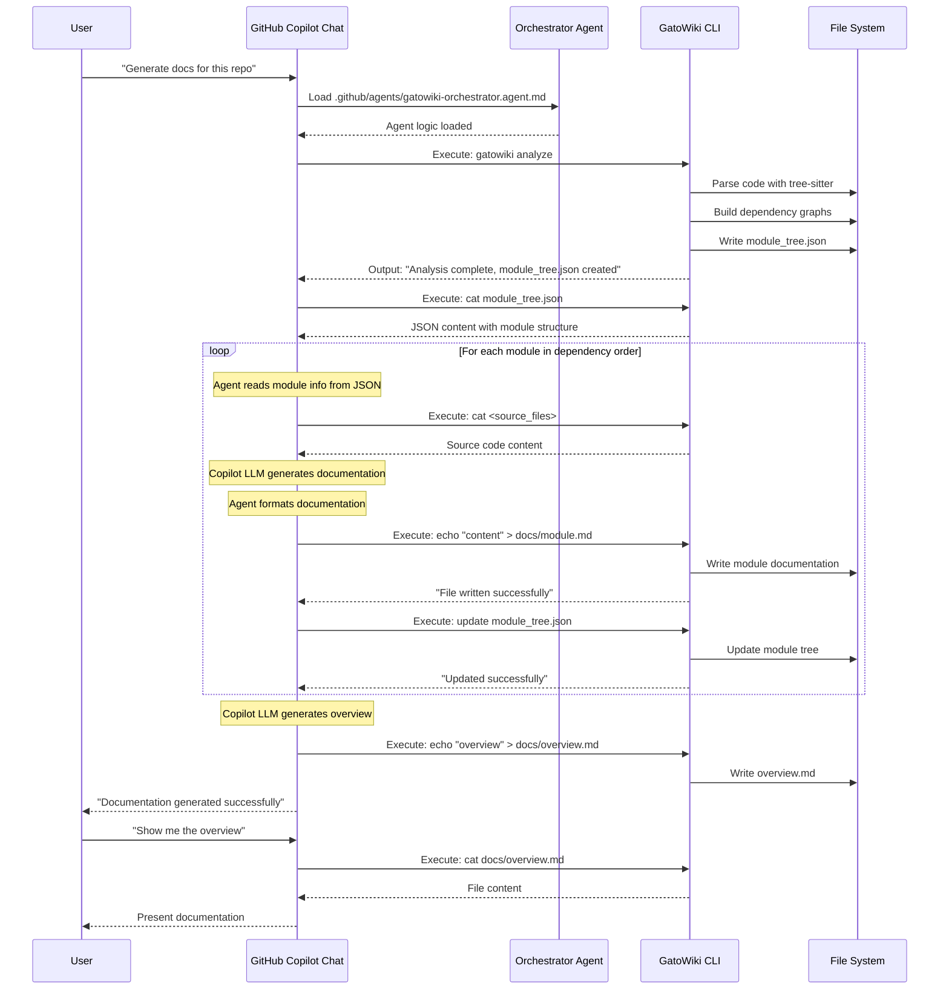

# Design Document: GitHub Copilot Integration for GatoWiki

## Overview

This design document outlines the integration of GatoWiki with GitHub Copilot Chat API by **replacing the current pydantic-ai agent system** with GitHub Copilot agents defined in markdown files. Instead of using direct Anthropic API calls orchestrated by Python code (`agent_orchestrator.py`), the system will leverage GitHub Copilot's agent framework (`.github/agents/*.agent.md`) to execute documentation generation workflows through natural language interactions.

This represents a **fundamental architectural shift** from the current implementation:

**Current Architecture**: Python-based multi-agent system using pydantic-ai → Direct Anthropic API calls → Programmatic orchestration

**New Architecture**: Markdown-defined GitHub Copilot agents → GitHub Copilot Chat Interface → Python CLI (no LLM API) → Agent reads output → Copilot generates content → Python writes files

The design follows a **human-in-the-loop agent orchestration approach**: documentation generation logic is encoded in markdown agent files that GitHub Copilot interprets and executes through its chat interface. This **completely eliminates** the dependency on direct LLM API access. The Python code performs analysis and file operations only, while all LLM interactions happen through GitHub Copilot Chat interface. Agents can be defined at both the project level (repository-specific) and global level (user-wide configuration).

### Key Design Principles

1. **No LLM API**: Remove all direct LLM API calls (Anthropic, OpenAI, etc.) from Python code
2. **Agent System Replacement**: Replace pydantic-ai Python agents with markdown-defined GitHub Copilot agents
3. **Human-in-the-Loop**: All LLM interactions happen through GitHub Copilot Chat interface (VS Code, IntelliJ, CLI)
4. **CLI as Data Provider**: Python CLI commands perform analysis and return structured data (JSON, text)
5. **Agent as Orchestrator**: GitHub Copilot agents read CLI output, generate content via chat, and instruct Python to write files
6. **Iterative Workflow**: Agent → Python CLI → Agent → Python CLI loop for complex documentation generation
7. **Standard Compliance**: Uses GitHub Copilot's official agent and prompt definition formats
8. **Flexible Deployment**: Supports both project-level (repository-specific) and global (user-wide) agent definitions

### Critical Architectural Changes

**What Changes**:
- **LLM Integration**: Direct API calls (Anthropic/OpenAI) → GitHub Copilot Chat interface only
- **Agent Framework**: pydantic-ai → GitHub Copilot markdown agents
- **Orchestration**: Python code (`agent_orchestrator.py`) → Markdown agent definitions + human-in-the-loop
- **Agent Tools**: Python functions → CLI commands that return data (no LLM calls)
- **Documentation Generation**: Python generates docs → Agent generates content, Python writes files

**What Stays the Same**:
- **Code Analysis**: Tree-sitter parsing and dependency analysis logic
- **File Operations**: Reading source code and writing documentation files
- **Module Clustering**: Hierarchical decomposition logic
- **Output Format**: Documentation structure and format

**What Gets Removed**:
- **All LLM API code**: `llm_services.py`, API client initialization, API calls
- **API Configuration**: No more API keys, base URLs, or model names in config
- **pydantic-ai agents**: Complete removal of agent orchestration code

## Architecture

### High-Level Architecture



**Architecture Notes**:
- **No LLM API in Python**: Python code does NOT call any LLM API
- **Agent Orchestrates**: GitHub Copilot agent reads CLI output and generates content
- **Iterative Loop**: Agent → CLI (analyze) → Agent (generate) → CLI (write) → repeat
- **Human-in-the-Loop**: All LLM interactions visible in chat interface
- **CLI as Tool**: Python CLI is a data provider and file writer, not an LLM client

### Component Interaction Flow



**Sequence Notes**:
- **No LLM API Calls**: Python code never calls any LLM API
- **Agent Reads CLI Output**: Copilot agent reads JSON/text output from CLI commands
- **Copilot Generates Content**: All documentation content generated by GitHub Copilot's LLM
- **CLI Writes Files**: Python CLI writes files based on agent instructions
- **Iterative Loop**: Agent orchestrates by repeatedly calling CLI and processing results

## Components and Interfaces

### 1. Agent and Prompt Definition Files

#### 1.1 Orchestrator Agent Definition (`.github/agents/gatowiki-orchestrator.agent.md`)

**Purpose**: Replace the Python-based `agent_orchestrator.py` with a markdown-defined agent that orchestrates multi-module documentation generation using GitHub Copilot Chat API instead of direct Anthropic API calls.

**Location Options**:
- **Project-level**: `.github/agents/gatowiki-orchestrator.agent.md` (repository-specific, committed to repo)
- **Global-level**: `~/.github/copilot/agents/gatowiki-orchestrator.agent.md` (user-wide, available across all repositories)

**Design Rationale**: This agent mirrors the logic currently in `agent_orchestrator.py` but executes through GitHub Copilot Chat API. It handles complex modules that require recursive decomposition and sub-module delegation. The markdown format allows the agent logic to be version-controlled and easily modified without changing Python code.

**Structure**:
```markdown
# GatoWiki Orchestrator Agent

You are the orchestrator agent for GatoWiki documentation generation. You replace the Python-based pydantic-ai agent system and use GitHub Copilot Chat API instead of direct Anthropic API calls.

## Your Role
You coordinate documentation generation for complex modules that contain sub-modules. You can:
1. Analyze module structure and complexity
2. Delegate sub-module documentation to leaf agents
3. Synthesize sub-module docs into cohesive module documentation
4. Maintain the module tree structure

## Available Tools (via CLI and File Operations)

### Code Analysis
- `gatowiki analyze --repo-path <path>` - Run dependency analysis, generate module_tree.json
- Read `module_tree.json` - Get hierarchical module structure
- Read `first_module_tree.json` - Get initial clustering results

### File Operations
- Read source code files from repository
- Read existing documentation files
- Write documentation to `docs/<module_name>.md`
- Update `module_tree.json` with documentation status

### Sub-Agent Delegation
- Invoke `gatowiki-leaf` agent for simple modules
- Pass component IDs and context to leaf agent
- Collect and integrate leaf agent outputs

## Orchestration Logic

When processing a complex module:

1. **Analyze Module Structure**
   - Read `module_tree.json` to understand module hierarchy
   - Identify core components for this module
   - Determine if module has sub-modules

2. **Decide Processing Strategy**
   - If module has sub-modules: Process each sub-module first (recursive)
   - If module is simple: Delegate to leaf agent
   - If module is complex but no sub-modules: Generate documentation directly

3. **Process Sub-Modules** (if applicable)
   - For each sub-module in dependency order:
     - Check if sub-module docs already exist
     - If not, invoke appropriate agent (orchestrator or leaf)
     - Wait for sub-module completion
     - Update module_tree.json

4. **Generate Module Documentation**
   - Read all relevant source code components
   - Read sub-module documentation (if any)
   - Use GitHub Copilot Chat API to generate:
     - Module overview
     - Component descriptions
     - Cross-component interactions
     - Architecture diagrams (Mermaid)
     - Data flow diagrams
   - Write to `docs/<module_name>.md`

5. **Update Module Tree**
   - Mark module as documented in module_tree.json
   - Record documentation file path
   - Update metadata

## Example Workflow

User: "Generate documentation for the backend module"

You:
1. Execute: `gatowiki analyze --repo-path .`
2. Read: `module_tree.json`
3. Identify: backend module has sub-modules [agent_tools, dependency_analyzer, ...]
4. For each sub-module:
   - Check: Does `docs/agent_tools.md` exist?
   - If no: Invoke leaf agent for agent_tools
   - Repeat for all sub-modules
5. Read: All sub-module documentation files
6. Read: Backend module source code
7. Call GitHub Copilot Chat API: Generate backend module overview
8. Write: `docs/backend.md`
9. Update: `module_tree.json`

## Error Handling
- If analysis fails: Report error, suggest checking repository structure
- If sub-module processing fails: Continue with other sub-modules, report failures
- If API calls fail: Retry with exponential backoff
- If file operations fail: Report permission or path issues

## Configuration
- Max recursion depth: Read from config or default to 3
- Module complexity threshold: 10 components
- API retry attempts: 3
```

**Responsibilities**:
- **Replace Python orchestration**: Encode the logic from `agent_orchestrator.py` in markdown
- **Manage module hierarchy**: Handle recursive sub-module processing
- **Coordinate agents**: Delegate to leaf agents when appropriate
- **API abstraction**: Use GitHub Copilot Chat API instead of direct Anthropic calls
- **State management**: Track documentation progress in module_tree.json

#### 1.2 Leaf Agent Definition (`.github/agents/gatowiki-leaf.agent.md`)

**Purpose**: Replace the leaf agent logic from `agent_orchestrator.py` (agents created with `LEAF_SYSTEM_PROMPT`) with a markdown-defined agent for simple modules that don't require sub-module delegation.

**Location**: `.github/agents/gatowiki-leaf.agent.md` in the repository

**Design Rationale**: Leaf agents handle simple modules with few components. They mirror the current pydantic-ai leaf agents but execute through GitHub Copilot Chat API. This separation from the orchestrator agent keeps the logic focused and maintainable.

**Structure**:
```markdown
# GatoWiki Leaf Agent

You are a leaf agent for GatoWiki documentation generation. You handle simple modules that don't require sub-module decomposition.

## Your Role
You generate documentation for modules with a manageable number of components (typically < 10). You:
1. Read source code for all components in the module
2. Analyze component interactions
3. Generate comprehensive module documentation
4. Create architecture diagrams

## Available Tools (via File Operations)

### Code Reading
- Read source code files for assigned components
- Parse component structure (classes, functions, interfaces)
- Identify dependencies between components

### Documentation Writing
- Write documentation to `docs/<module_name>.md`
- Include: Overview, component descriptions, interactions, diagrams
- Use Mermaid for architecture visualization

### Context Access
- Read `module_tree.json` for module context
- Read parent module documentation (if exists)
- Access repository-level information

## Documentation Generation Logic

When assigned a module:

1. **Gather Context**
   - Read module_tree.json to understand module position
   - Identify all components assigned to this module
   - Read parent module docs for context (if applicable)

2. **Read Source Code**
   - For each component in the module:
     - Read the source file
     - Extract: Classes, functions, interfaces, types
     - Note: Dependencies, imports, exports

3. **Analyze Interactions**
   - Identify how components interact
   - Map data flow between components
   - Note external dependencies

4. **Generate Documentation**
   - Use GitHub Copilot Chat API to generate:
     - **Module Overview**: Purpose, responsibilities, key concepts
     - **Component Descriptions**: What each component does
     - **Interactions**: How components work together
     - **Architecture Diagram**: Mermaid diagram showing structure
     - **Data Flow**: How data moves through the module
     - **Usage Examples**: How to use the module
     - **Dependencies**: External and internal dependencies

5. **Write Documentation File**
   - Format as markdown
   - Include all sections
   - Embed Mermaid diagrams
   - Write to `docs/<module_name>.md`

6. **Update Module Tree**
   - Mark module as documented
   - Record file path

## Documentation Template

```markdown
# Module: <module_name>

## Overview
[High-level description of module purpose and responsibilities]

## Architecture
```mermaid
[Architecture diagram showing components and relationships]
```

## Components

### <Component 1>
[Description, responsibilities, key methods/functions]

### <Component 2>
[Description, responsibilities, key methods/functions]

## Interactions
[How components interact, data flow, sequence diagrams if needed]

## Dependencies
- Internal: [Other modules this depends on]
- External: [Third-party libraries]

## Usage Examples
[Code examples showing how to use the module]
```

## Example Workflow

User: "Document the config_manager module"

You:
1. Read: `module_tree.json` - Find config_manager module
2. Identify components: [config_manager.py, models/config.py]
3. Read: `gatowiki/cli/config_manager.py` source code
4. Read: `gatowiki/cli/models/config.py` source code
5. Analyze: ConfigManager class, Config model, keyring integration
6. Call GitHub Copilot Chat API: Generate documentation with context
7. Write: `docs/config_manager.md` with all sections
8. Update: `module_tree.json` - Mark as documented

## Error Handling
- If source files not found: Report missing files
- If API calls fail: Retry with exponential backoff
- If documentation exists: Ask user if they want to overwrite
- If write fails: Report permission issues
```

**Responsibilities**:
- **Replace Python leaf agents**: Encode the logic from leaf agents in markdown
- **Handle simple modules**: Process modules without sub-module complexity
- **Direct documentation**: Generate docs without delegation
- **API abstraction**: Use GitHub Copilot Chat API for content generation

#### 1.3 Prompt Definition File (`.github/prompts/gatowiki.prompt.md`)

**Purpose**: Provide reusable prompt templates that both orchestrator and leaf agents can use for specific documentation tasks.

**Location**: `.github/prompts/gatowiki.prompt.md` in the repository

**Design Rationale**: Prompt files provide standardized templates for specific documentation generation tasks. They can be referenced by both agent types to ensure consistent output quality and format.

**Structure**:
```markdown
# GatoWiki Prompt Templates

## Module Overview Generation
Generate a comprehensive overview for a software module.

Context needed:
- Module name
- Component list
- Source code
- Sub-module documentation (if any)

Output format:
- Purpose and responsibilities
- Key concepts
- High-level architecture
- Main components summary

## Component Description
Generate detailed description for a code component (class, function, module).

Context needed:
- Component source code
- Component type (class/function/interface)
- Dependencies
- Usage context

Output format:
- Purpose
- Responsibilities
- Key methods/functions
- Parameters and return types
- Usage examples

## Architecture Diagram
Generate Mermaid diagram showing module architecture.

Context needed:
- Component list
- Component relationships
- Data flow
- External dependencies

Output format:
```mermaid
graph TB
    [Component relationships]
```

## Interaction Analysis
Analyze and document how components interact.

Context needed:
- Component source code
- Call graphs
- Data flow

Output format:
- Interaction patterns
- Sequence diagrams (if complex)
- Data flow description

## Repository Overview
Generate repository-level documentation.

Context needed:
- All module documentation
- Module tree structure
- Repository purpose

Output format:
- Project overview
- Architecture overview
- Module hierarchy
- Key technologies
- Getting started guide
```

**Responsibilities**:
- Define reusable prompt templates for documentation tasks
- Specify required context for each template
- Provide output format specifications
- Enable consistent documentation quality across agents

### 2. GatoWiki CLI Interface

**Modified Interface** (requires changes to support new workflow):

```python
# gatowiki/cli/main.py
@click.group()
def cli():
    """GatoWiki - AI-powered documentation generator"""
    pass

@cli.command()
@click.option('--api-key', help='GitHub Copilot API key')
@click.option('--base-url', help='GitHub Copilot API base URL')
@click.option('--main-model', help='Primary model (via Copilot)')
@click.option('--cluster-model', help='Clustering model (via Copilot)')
def config(api_key, base_url, main_model, cluster_model):
    """Configure GatoWiki settings for GitHub Copilot"""
    pass

@cli.command()
@click.option('--repo-path', default='.', help='Repository path')
@click.option('--output', default='docs', help='Output directory')
@click.option('--languages', help='Language filters')
@click.option('--max-depth', type=int, help='Max module depth')
def analyze(repo_path, output, languages, max_depth):
    """
    Analyze repository and generate module_tree.json
    
    This command performs:
    - Tree-sitter parsing of source code
    - Dependency graph construction
    - Module clustering and hierarchy generation
    - Outputs: module_tree.json, first_module_tree.json
    
    NOTE: This does NOT generate documentation. It only performs
    code analysis. Documentation generation is handled by GitHub
    Copilot agents.
    """
    pass

@cli.command()
@click.option('--output', default='docs', help='Output directory')
@click.option('--github-pages', is_flag=True, help='Generate GitHub Pages')
@click.option('--create-branch', is_flag=True, help='Create gh-pages branch')
def publish(output, github_pages, create_branch):
    """
    Publish generated documentation to GitHub Pages
    
    This command assumes documentation has already been generated
    by GitHub Copilot agents. It handles:
    - HTML viewer generation
    - gh-pages branch creation
    - Git operations
    """
    pass
```

**Key Changes**:
- **New `analyze` command**: Separates code analysis from documentation generation
  - Performs tree-sitter parsing, dependency analysis, module clustering
  - Outputs `module_tree.json` and `first_module_tree.json`
  - Does NOT call LLM APIs or generate documentation
  - GitHub Copilot agents use this output to drive documentation generation

- **Modified `config` command**: Now configures GitHub Copilot API credentials instead of Anthropic
  - API key is for GitHub Copilot, not Anthropic
  - Base URL points to GitHub Copilot API endpoint

- **New `publish` command**: Replaces the documentation generation part of old `generate` command
  - Assumes docs already exist (generated by agents)
  - Handles GitHub Pages publishing only

- **Removed `generate` command**: Documentation generation now happens through GitHub Copilot agents, not CLI

**Interface Contract**:
- **Input**: Command-line arguments and flags
- **Output**: 
  - stdout: Progress messages, analysis results
  - stderr: Error messages, warnings
  - Exit codes: 0 (success), non-zero (failure)
- **Side Effects**: 
  - `analyze`: Writes module_tree.json, first_module_tree.json
  - `publish`: Creates gh-pages branch, writes HTML files

### 3. Documentation Output Files

**Generated Artifacts**:

```
docs/
├── overview.md              # Repository-level documentation
├── <module_name>.md         # Module-specific documentation
├── module_tree.json         # Hierarchical module structure
├── first_module_tree.json   # Initial clustering result
├── metadata.json            # Generation metadata
└── index.html               # Interactive viewer (with --github-pages)
```

**File Formats**:
- **Markdown**: UTF-8 encoded, GitHub Flavored Markdown
- **JSON**: UTF-8 encoded, pretty-printed with 2-space indentation
- **HTML**: UTF-8 encoded, self-contained with embedded CSS/JS

### 4. GitHub Copilot Integration Points

**Integration Mechanisms**:

1. **Agent Discovery**: Copilot discovers and loads agent definitions from `.github/agents/` (project-level) or `~/.github/copilot/agents/` (global-level)
2. **Prompt Loading**: Copilot reads prompt templates from `.github/prompts/` for reusable operation patterns
3. **Command Execution**: Copilot executes `gatowiki analyze` for code analysis
4. **File Operations**: Copilot reads source code files and writes documentation files directly
5. **API Calls**: Copilot makes GitHub Copilot Chat API calls for documentation generation (replaces direct Anthropic API calls)
6. **State Management**: Copilot reads/updates `module_tree.json` to track documentation progress
7. **Context Awareness**: Copilot uses repository structure, module tree, and source code as context

**Deployment Flexibility**:
- **Project-level agents**: Committed to repository, shared with team, specific to project needs
- **Global agents**: Stored in user's home directory, available across all repositories, personal workflow optimization

**Critical Differences from Current System**:

| Aspect | Current (pydantic-ai) | New (GitHub Copilot) |
|--------|----------------------|---------------------|
| **LLM API** | Direct Anthropic API calls | GitHub Copilot Chat API |
| **Agent Framework** | Python code (pydantic-ai) | Markdown definitions |
| **Orchestration** | `agent_orchestrator.py` | Orchestrator agent markdown |
| **Agent Tools** | Python functions | CLI commands + file operations |
| **State Management** | Python objects | JSON files (module_tree.json) |
| **Execution** | Programmatic | Natural language driven |
| **Configuration** | Anthropic API key | GitHub Copilot API key |

## Data Models

### Agent and Prompt File Schema

```typescript
interface AgentDefinition {
  name: string;                  // Agent name (e.g., "GatoWiki Documentation Generator")
  capabilities: string;          // Description of what the agent can do
  commands: Command[];           // Available CLI commands
  executionLogic: ExecutionStep[]; // Decision-making logic for command execution
  documentationReading: ReadingStrategy[]; // How to read and present docs
  errorHandling: ErrorGuide[];   // Troubleshooting guidance
  customization: string;         // Guidance for modifying agent behavior
  scope: 'project' | 'global';   // Agent availability scope
}

interface PromptDefinition {
  name: string;                  // Prompt template name
  description: string;           // What the prompt achieves
  inputs: InputSpec[];           // Required inputs
  steps: string[];               // Execution steps
  command: string;               // CLI command template
}

interface Command {
  name: string;                  // Command name (e.g., "config set")
  syntax: string;                // Full command syntax
  description: string;           // What the command does
  options: Option[];             // Available flags and arguments
  examples: string[];            // Usage examples
  supportsGitHubURL: boolean;    // Whether command accepts GitHub URLs
}

interface ExecutionStep {
  condition: string;             // When to execute this step
  action: string;                // What command to run
  nextStep: string;              // What to do after
}

interface ReadingStrategy {
  query: string;                 // Type of user query
  files: string[];               // Files to read
  presentation: string;          // How to present information
}

interface InputSpec {
  name: string;                  // Input parameter name
  type: string;                  // Input type (string, boolean, etc.)
  required: boolean;             // Whether input is required
  description: string;           // Input description
}
```

### CLI Command Schema

```typescript
interface CLICommand {
  command: string;               // Base command (e.g., "gatowiki")
  subcommand: string;            // Subcommand (e.g., "generate")
  options: Record<string, any>;  // Command options
  workingDirectory: string;      // Execution directory
}

interface CLIOutput {
  stdout: string;                // Standard output
  stderr: string;                // Standard error
  exitCode: number;              // Exit code
  duration: number;              // Execution time (ms)
}
```

### Documentation Structure Schema

```typescript
interface ModuleTree {
  name: string;                  // Module name
  path: string;                  // Module path
  components: string[];          // Component IDs
  submodules: ModuleTree[];      // Child modules
  documentation: string;         // Path to .md file
}

interface DocumentationMetadata {
  generatedAt: string;           // ISO 8601 timestamp
  repository: string;            // Repository path/URL
  totalModules: number;          // Number of modules processed
  codeWikiVersion: string;       // GatoWiki version
  configuration: Config;         // Generation configuration
}
```


## Correctness Properties

*A property is a characteristic or behavior that should hold true across all valid executions of a system—essentially, a formal statement about what the system should do. Properties serve as the bridge between human-readable specifications and machine-verifiable correctness guarantees.*

### Property 1: Configuration persistence
*For any* valid configuration parameters (API key, base URL, model names), executing `gatowiki config set` with those parameters should result in `gatowiki config show` displaying those same values.
**Validates: Requirements 2.1, 2.3**

### Property 2: API key security
*For any* API key provided to `gatowiki config set --api-key`, the key should be stored in the system keychain and not appear in plaintext in any configuration files.
**Validates: Requirements 2.2**

### Property 3: Configuration validation correctness
*For any* configuration state, `gatowiki config validate` should return success (exit code 0) if and only if all required fields (API key, base URL, models) are present and valid.
**Validates: Requirements 2.4**

### Property 4: Error reporting to stderr
*For any* invalid command or failed operation, the CLI should write error messages to stderr (not stdout) with exit code non-zero.
**Validates: Requirements 2.5, 3.5**

### Property 5: Command parameter acceptance
*For any* valid combination of flags (--output, --verbose, --github-pages, --create-branch, --languages, --max-depth), `gatowiki generate` should accept them without error.
**Validates: Requirements 3.1, 8.1, 8.2, 8.3, 8.4**

### Property 6: Output directory creation
*For any* specified output directory path, executing `gatowiki generate --output <path>` should create that directory if it doesn't exist and write documentation files to it.
**Validates: Requirements 8.1**

### Property 7: Verbose output enhancement
*For any* repository, executing `gatowiki generate --verbose` should produce more stdout output than executing `gatowiki generate` without the flag.
**Validates: Requirements 4.1, 8.2**

### Property 8: Progress indicator presence
*For any* documentation generation run with --verbose, the stdout should contain progress indicators showing module processing status.
**Validates: Requirements 4.2, 4.3**

### Property 9: Completion summary presence
*For any* successful documentation generation, the final stdout should contain a summary message indicating completion and output location.
**Validates: Requirements 4.5**

### Property 10: GitHub Pages file generation
*For any* repository, executing `gatowiki generate --github-pages` should produce an `index.html` file in the output directory in addition to markdown files.
**Validates: Requirements 7.1, 7.2**

### Property 11: Branch creation with uncommitted changes warning
*For any* repository with uncommitted changes, executing `gatowiki generate --create-branch` should output a warning message to stdout or stderr.
**Validates: Requirements 7.5**

### Property 12: CLI independence
*For any* GatoWiki CLI command, removing all instruction files (`.github/copilot-instructions.md`, `AGENTS.md`) should not affect the command's execution or output.
**Validates: Requirements 6.3**

### Example-Based Validation

The following criteria are validated through example-based testing rather than universal properties:

**Example 1: Agent definition file structure**
The `.github/agents/gatowiki.agent.md` file should contain:
- A header section explaining the agent's purpose and capabilities
- A commands section listing all CLI commands with syntax
- A command execution logic section with decision-making steps
- A reading documentation section with file paths and presentation strategies
- An error handling section with troubleshooting guidance
- A customization section explaining how to modify agent behavior
**Validates: Requirements 1.1, 1.3, 1.4, 9.1, 9.2, 9.4, 9.5**

**Example 2: Prompt definition file structure**
The `.github/prompts/gatowiki.prompt.md` file should contain:
- Multiple prompt templates for common operations
- Input specifications for each template
- Step-by-step execution guidance
- Command templates with parameter placeholders
**Validates: Requirements 1.2, 9.3**

**Example 3: Global agent availability**
When an agent file is placed at `~/.github/copilot/agents/gatowiki.agent.md`, it should be available across all repositories for that user.
**Validates: Requirements 1.4**

**Example 4: Generated documentation structure**
After successful generation, the output directory should contain:
- `overview.md` with repository-level documentation
- `<module>.md` files for each module
- `module_tree.json` with hierarchical structure
- `metadata.json` with generation information
**Validates: Requirements 5.1, 5.2, 5.3**

**Example 5: Mermaid diagram presence**
Generated markdown files should contain Mermaid code blocks (```mermaid) with architecture diagrams.
**Validates: Requirements 5.4**

**Example 6: Command documentation completeness**
The agent definition file should document all existing CLI commands: `config set`, `config show`, `config validate`, `generate` (with both local path and GitHub URL support).
**Validates: Requirements 3.2, 3.3, 6.2**

**Example 7: Agent invocation**
When a user types "Generate documentation for this repository" in GitHub Copilot Chat, the agent should execute the appropriate `gatowiki generate` command.
**Validates: Requirements 1.5**

## Error Handling

### Error Categories

#### 1. Configuration Errors

**Missing Configuration**
- **Detection**: `gatowiki config validate` returns non-zero exit code
- **Handling**: CLI outputs specific missing fields to stderr
- **User Guidance**: Instruction files guide Copilot to prompt user for missing values

**Invalid API Credentials**
- **Detection**: API calls fail with authentication errors
- **Handling**: CLI outputs authentication error to stderr
- **User Guidance**: Instruction files guide Copilot to suggest re-running `config set`

**Keychain Access Errors**
- **Detection**: Keyring operations raise `KeyringError`
- **Handling**: CLI outputs keychain error message to stderr
- **User Guidance**: Instruction files guide Copilot to suggest system keychain troubleshooting

#### 2. Repository Errors

**Invalid Repository Path**
- **Detection**: Path does not exist or is not a directory
- **Handling**: CLI outputs "Invalid repository path" to stderr with exit code 1
- **User Guidance**: Instruction files guide Copilot to verify path and suggest alternatives

**Unsupported Language**
- **Detection**: No supported language files found in repository
- **Handling**: CLI outputs "No supported languages found" to stderr
- **User Guidance**: Instruction files list supported languages and suggest checking repository contents

**Git Errors**
- **Detection**: Git operations fail (e.g., branch creation with uncommitted changes)
- **Handling**: CLI outputs git error message to stderr
- **User Guidance**: Instruction files guide Copilot to suggest committing changes or using different flags

#### 3. Generation Errors

**LLM API Errors**
- **Detection**: API calls fail with network or rate limit errors
- **Handling**: CLI outputs API error details to stderr
- **User Guidance**: Instruction files guide Copilot to suggest retrying or checking API status

**File System Errors**
- **Detection**: Cannot write to output directory (permissions, disk space)
- **Handling**: CLI outputs file system error to stderr
- **User Guidance**: Instruction files guide Copilot to suggest checking permissions and disk space

**Parsing Errors**
- **Detection**: Tree-sitter fails to parse source files
- **Handling**: CLI logs parsing errors but continues with other files
- **User Guidance**: Instruction files guide Copilot to note that some files may be skipped

### Error Recovery Strategies

#### Automatic Recovery

1. **Fallback Models**: When main LLM fails, automatically try fallback model
2. **Partial Generation**: Continue processing other modules if one module fails
3. **Incremental Updates**: Skip already-generated documentation files

#### User-Guided Recovery

1. **Configuration Repair**: Copilot guides user through `config set` to fix invalid configuration
2. **Retry with Options**: Copilot suggests alternative flags (e.g., different output directory)
3. **Manual Intervention**: Copilot explains error and suggests manual fixes (e.g., commit changes before branch creation)

### Error Message Format

All error messages follow this structure:

```
ERROR: <Brief description>
Details: <Specific error information>
Suggestion: <Actionable next step>
```

Example:
```
ERROR: Configuration incomplete
Details: Missing API key and base URL
Suggestion: Run 'gatowiki config set --api-key <key> --base-url <url>'
```

## Testing Strategy

### Unit Testing

Unit tests verify specific CLI command behaviors and edge cases:

**Configuration Commands**
- Test `config set` with valid and invalid parameters
- Test `config show` output format
- Test `config validate` with complete and incomplete configurations
- Test keychain integration (mocked)

**Generate Command**
- Test flag parsing (--output, --verbose, --github-pages, etc.)
- Test output directory creation
- Test file generation (mocked LLM calls)
- Test error handling for invalid inputs

**File Operations**
- Test reading/writing markdown files
- Test JSON serialization/deserialization
- Test HTML generation

### Property-Based Testing

Property-based tests verify universal properties across many inputs using **Hypothesis** (Python property-based testing library):

**Configuration**: Minimum 100 iterations per property test

**Property Tests**:

1. **Config Persistence Property** (Property 1)
   - Generate random valid configurations
   - Set configuration
   - Verify show command returns same values
   - **Feature: github-copilot-integration, Property 1: Configuration persistence**

2. **API Key Security Property** (Property 2)
   - Generate random API keys
   - Set configuration with API key
   - Verify key not in plaintext files
   - Verify key retrievable from keychain
   - **Feature: github-copilot-integration, Property 2: API key security**

3. **Validation Correctness Property** (Property 3)
   - Generate random configuration states (complete and incomplete)
   - Run validate command
   - Verify exit code matches completeness
   - **Feature: github-copilot-integration, Property 3: Configuration validation correctness**

4. **Error Stderr Property** (Property 4)
   - Generate random invalid commands
   - Execute commands
   - Verify errors go to stderr, not stdout
   - Verify non-zero exit codes
   - **Feature: github-copilot-integration, Property 4: Error reporting to stderr**

5. **Parameter Acceptance Property** (Property 5)
   - Generate random valid flag combinations
   - Execute generate command with flags
   - Verify command accepts without error
   - **Feature: github-copilot-integration, Property 5: Command parameter acceptance**

6. **Output Directory Property** (Property 6)
   - Generate random directory paths
   - Execute generate with --output
   - Verify directory created and contains files
   - **Feature: github-copilot-integration, Property 6: Output directory creation**

7. **Verbose Enhancement Property** (Property 7)
   - Generate random repositories
   - Execute with and without --verbose
   - Verify verbose produces more output
   - **Feature: github-copilot-integration, Property 7: Verbose output enhancement**

8. **Progress Indicator Property** (Property 8)
   - Generate random repositories
   - Execute with --verbose
   - Verify stdout contains progress patterns
   - **Feature: github-copilot-integration, Property 8: Progress indicator presence**

9. **Completion Summary Property** (Property 9)
   - Generate random repositories
   - Execute generate command
   - Verify stdout ends with summary message
   - **Feature: github-copilot-integration, Property 9: Completion summary presence**

10. **GitHub Pages Generation Property** (Property 10)
    - Generate random repositories
    - Execute with --github-pages
    - Verify index.html exists in output
    - **Feature: github-copilot-integration, Property 10: GitHub Pages file generation**

11. **Uncommitted Changes Warning Property** (Property 11)
    - Create repositories with uncommitted changes
    - Execute with --create-branch
    - Verify warning in output
    - **Feature: github-copilot-integration, Property 11: Branch creation with uncommitted changes warning**

12. **CLI Independence Property** (Property 12)
    - Generate random CLI commands
    - Execute with and without instruction files
    - Verify identical behavior
    - **Feature: github-copilot-integration, Property 12: CLI independence**

### Integration Testing

Integration tests verify end-to-end workflows:

**Full Generation Workflow**
1. Configure GatoWiki
2. Generate documentation for test repository
3. Verify all expected files created
4. Verify file contents match expected structure

**GitHub Pages Workflow**
1. Configure GatoWiki
2. Generate with --github-pages --create-branch
3. Verify gh-pages branch created
4. Verify index.html accessible

**Error Recovery Workflow**
1. Attempt generation with invalid configuration
2. Verify error message
3. Fix configuration
4. Retry generation successfully

### Manual Testing with GitHub Copilot

Manual testing verifies GitHub Copilot integration:

**Instruction File Validation**
1. Create instruction files in test repository
2. Open repository in VS Code with GitHub Copilot
3. Verify Copilot recognizes GatoWiki commands
4. Test natural language requests

**Command Execution**
1. Ask Copilot to "generate documentation"
2. Verify Copilot constructs correct CLI command
3. Verify output displayed in chat
4. Verify files generated correctly

**Documentation Querying**
1. Generate documentation
2. Ask Copilot about specific modules
3. Verify Copilot reads and presents correct files
4. Verify Copilot extracts Mermaid diagrams

## Architectural Migration Details

### Current System (pydantic-ai + Anthropic)

**Workflow**:
1. User runs: `gatowiki generate`
2. CLI calls `documentation_generator.py`
3. `documentation_generator.py` calls `agent_orchestrator.py`
4. `agent_orchestrator.py` creates pydantic-ai agents:
   - Orchestrator agents for complex modules (with `generate_sub_module_documentation_tool`)
   - Leaf agents for simple modules
5. Agents make direct Anthropic API calls
6. Agents use Python tools: `read_code_components_tool`, `str_replace_editor_tool`, `generate_sub_module_documentation_tool`
7. Documentation files written by Python code
8. Module tree updated by Python code

**Key Files**:
- `agent_orchestrator.py` - Creates and manages agents
- `agent_tools/` - Python functions agents can call
- `prompt_template.py` - System prompts for agents
- `llm_services.py` - Anthropic API integration

### New System (GitHub Copilot Agents)

**Workflow**:
1. User runs: `gatowiki analyze` (one-time setup)
2. CLI performs code analysis, generates `module_tree.json`
3. User opens GitHub Copilot Chat
4. User: "Generate documentation for this repository"
5. GitHub Copilot loads `.github/agents/gatowiki-orchestrator.agent.md`
6. Orchestrator agent:
   - Reads `module_tree.json`
   - Processes modules in dependency order
   - For complex modules: Recursively processes sub-modules
   - For simple modules: Delegates to leaf agent
7. Leaf agent (`.github/agents/gatowiki-leaf.agent.md`):
   - Reads source code files
   - Makes GitHub Copilot Chat API calls for doc generation
   - Writes documentation files
   - Updates `module_tree.json`
8. Orchestrator synthesizes sub-module docs into module docs
9. User runs: `gatowiki publish --github-pages` (optional)

**Key Files**:
- `.github/agents/gatowiki-orchestrator.agent.md` - Orchestration logic (replaces `agent_orchestrator.py`)
- `.github/agents/gatowiki-leaf.agent.md` - Leaf agent logic
- `.github/prompts/gatowiki.prompt.md` - Reusable prompts
- `gatowiki analyze` CLI command - Code analysis only
- `gatowiki publish` CLI command - GitHub Pages publishing

### Migration Mapping

| Current Component | New Component | Notes |
|------------------|---------------|-------|
| `agent_orchestrator.py` | `gatowiki-orchestrator.agent.md` | Logic encoded in markdown |
| `SYSTEM_PROMPT` | Orchestrator agent definition | System prompt becomes agent instructions |
| `LEAF_SYSTEM_PROMPT` | Leaf agent definition | Leaf prompt becomes leaf agent instructions |
| `read_code_components_tool` | File read operations | Copilot reads files directly |
| `str_replace_editor_tool` | File write operations | Copilot writes files directly |
| `generate_sub_module_documentation_tool` | Agent delegation | Orchestrator invokes leaf agent |
| `create_agent()` | Agent file loading | GitHub Copilot loads agent definitions |
| `process_module()` | Agent execution | GitHub Copilot executes agent logic |
| Anthropic API calls | GitHub Copilot Chat API | API provider change |
| `gatowiki generate` | `gatowiki analyze` + Copilot Chat | Workflow split |

### Complexity Threshold Logic

**Current** (`agent_orchestrator.py`):
```python
def is_complex_module(components, core_component_ids):
    return len(core_component_ids) > 10  # Threshold
```

**New** (Orchestrator agent markdown):
```markdown
## Decide Processing Strategy
- If module has > 10 components: Complex module, process sub-modules
- If module has ≤ 10 components: Simple module, delegate to leaf agent
```

### Recursive Processing

**Current** (Python):
```python
async def process_module(self, module_name, ...):
    agent = self.create_agent(module_name, components, core_component_ids)
    # Agent can call generate_sub_module_documentation_tool
    # which recursively calls process_module for sub-modules
```

**New** (Markdown):
```markdown
## Process Sub-Modules
For each sub-module in dependency order:
  - Check if sub-module docs already exist
  - If not, invoke appropriate agent (orchestrator or leaf)
  - Wait for sub-module completion
  - Update module_tree.json
```

## Implementation Notes

### File Locations

**Agent and Prompt Files** (to be created):
- `.github/agents/gatowiki.agent.md` - Project-level agent definition (repository-specific)
- `.github/prompts/gatowiki.prompt.md` - Prompt templates for common operations
- `~/.github/copilot/agents/gatowiki.agent.md` - Global agent definition (user-wide, optional)

**Design Rationale**: The dual-location approach (project vs. global) provides flexibility:
- **Project-level** (`.github/agents/`): Ideal for teams, version-controlled, repository-specific customizations
- **Global-level** (`~/.github/copilot/agents/`): Ideal for individual developers, personal workflow optimization, available across all repositories

**Template Files** (to be created):
- `templates/agent-definition.md` - Template for agent definition files
- `templates/prompt-definition.md` - Template for prompt definition files

**Documentation** (to be created):
- `docs/github-copilot-integration.md` - Integration guide for users
- `README.md` - Update with GitHub Copilot section

### Required Code Changes

This integration requires **significant modifications** to existing Python code:

**Code to Remove**:
- `gatowiki/src/core/agent_orchestrator.py` - Replaced by markdown agent definitions
- `gatowiki/src/core/agent_tools/` - Agent tools replaced by CLI commands and file operations
- `gatowiki/src/core/prompt_template.py` - System prompts replaced by markdown agent definitions
- Direct Anthropic API integration in `gatowiki/src/core/llm_services.py`

**Code to Modify**:
- `gatowiki/cli/main.py` - Add `analyze` command, modify `config` command, add `publish` command, remove `generate` command
- `gatowiki/cli/config_manager.py` - Update to store GitHub Copilot API credentials instead of Anthropic
- `gatowiki/src/core/documentation_generator.py` - Simplify to only handle analysis, not doc generation
- `gatowiki/src/core/llm_services.py` - Replace Anthropic API calls with GitHub Copilot Chat API calls (or remove if not needed)

**Code to Keep**:
- All dependency analysis code (`gatowiki/src/core/dependency_analyzer/`)
- Tree-sitter parsing logic
- Module clustering logic (`gatowiki/src/core/cluster_modules.py`)
- Git operations (`gatowiki/cli/git_manager.py`)
- HTML generation (`gatowiki/cli/html_generator.py`)
- Configuration management (modified for GitHub Copilot)

**New Code to Add**:
- GitHub Copilot Chat API client (if not using existing SDK)
- Agent definition files in `.github/agents/`
- Prompt template files in `.github/prompts/`

**Integration Approach**:
1. Create markdown agent definitions that encode orchestration logic
2. Modify CLI to separate analysis from documentation generation
3. Update configuration to use GitHub Copilot API credentials
4. Remove Python agent orchestration code
5. Keep all code analysis and file generation utilities

### Maintenance Considerations

**When Adding New CLI Commands**:
1. Implement new command in Python CLI code
2. Update `.github/agents/gatowiki-orchestrator.agent.md` with new command syntax
3. Update `.github/agents/gatowiki-leaf.agent.md` if relevant
4. Create new prompt templates in `.github/prompts/gatowiki.prompt.md` if needed
5. Update global agent file if maintaining one

**When Changing CLI Options**:
1. Modify Python CLI code to support new options
2. Update agent definition files with new options
3. Update prompt templates with new parameters
4. Update examples in agent files

**When Modifying Documentation Logic**:
1. Update agent definition files (orchestrator or leaf)
2. Modify prompt templates if needed
3. No changes to Python agent code (since it no longer exists)

**When Fixing Bugs**:
1. Fix bug in Python code
2. Update instruction files only if CLI interface changes
3. Most bug fixes require no instruction file updates

### Deployment Strategy

**Phase 1: CLI Refactoring**
1. Add `gatowiki analyze` command for code analysis only
2. Modify `gatowiki config` to use GitHub Copilot API credentials
3. Add `gatowiki publish` command for GitHub Pages
4. Remove `gatowiki generate` command (replaced by agents)
5. Test CLI changes

**Phase 2: Agent Definition Creation**
1. Create `.github/agents/gatowiki-orchestrator.agent.md`
2. Create `.github/agents/gatowiki-leaf.agent.md`
3. Create `.github/prompts/gatowiki.prompt.md`
4. Encode orchestration logic from `agent_orchestrator.py` in markdown
5. Encode leaf agent logic in markdown

**Phase 3: Python Code Removal**
1. Remove `agent_orchestrator.py`
2. Remove `agent_tools/` directory
3. Remove `prompt_template.py`
4. Update `llm_services.py` to use GitHub Copilot API
5. Update imports and dependencies

**Phase 4: Testing**
1. Test `gatowiki analyze` command
2. Test agent definitions with GitHub Copilot Chat
3. Verify end-to-end documentation generation workflow
4. Test with various repository sizes and complexities
5. Refine agent definitions based on results

**Phase 5: Documentation**
1. Write migration guide from Anthropic to GitHub Copilot
2. Update README with new workflow
3. Document agent customization
4. Create troubleshooting guide

**Phase 6: Distribution**
1. Release new version with breaking changes notice
2. Provide migration path for existing users
3. Update documentation site
4. Announce API provider change

### Future Enhancements

**Potential Improvements**:
1. **Specialized Agents**: Create agents for specific documentation types (API docs, architecture docs, etc.)
2. **Multi-Language Support**: Optimize agents for different programming languages
3. **Interactive Workflows**: Add multi-step workflows with user confirmation points
4. **Caching**: Implement caching for GitHub Copilot API responses to reduce costs
5. **Parallel Processing**: Enable parallel documentation generation for independent modules
6. **Quality Metrics**: Add agents that evaluate documentation quality

**Breaking Changes**:
This is a **major version change** with breaking changes:
- **API Provider Change**: Anthropic → GitHub Copilot (users must have GitHub Copilot subscription)
- **Configuration Change**: API credentials must be reconfigured
- **CLI Changes**: `generate` command removed, `analyze` and `publish` commands added
- **No Backward Compatibility**: Old configuration and workflows will not work
- **Migration Required**: Users must migrate to new system

**Migration Path**:
1. Users must obtain GitHub Copilot API access
2. Reconfigure with `gatowiki config set` using GitHub Copilot credentials
3. Update workflows to use new CLI commands
4. Install agent definition files in repository
5. Use GitHub Copilot Chat for documentation generation
